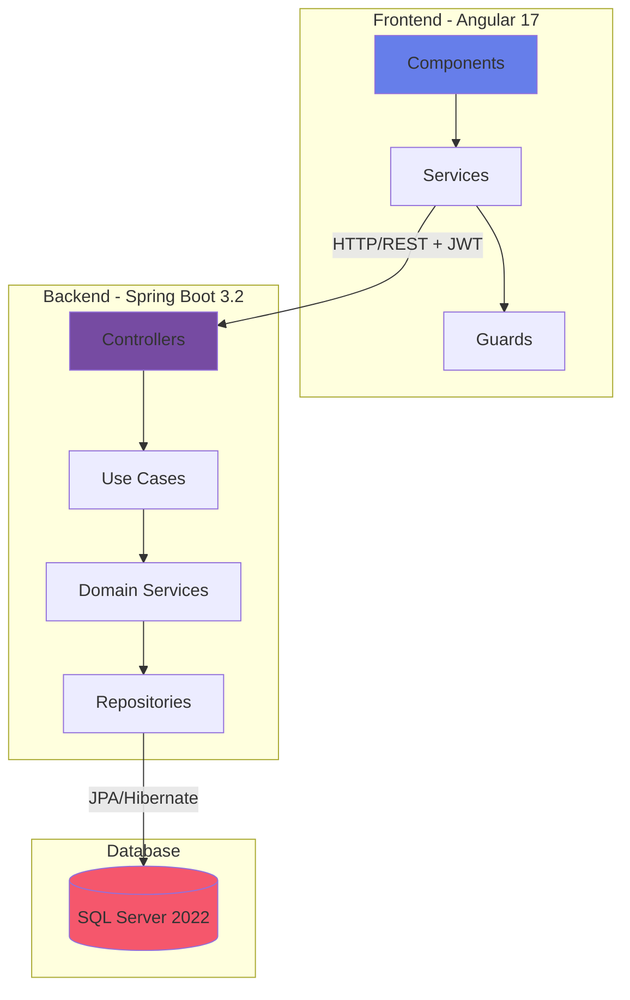

# 🎯 DigicampMonitoring


Application web de gestion des projets et des ressources pour le périmètre Digicamp. Elle permet de suivre les mouvements en termes de ressources, leur affectation aux différents projets internes et de générer des newsletters de projets en PDF.

## 📚 Documentation

- 🚀 **[Démarrage Rapide](./docs/QUICKSTART.md)** - Guide de démarrage en 5 minutes
- 📖 **[Guide Utilisateur](./docs/USER_GUIDE.md)** - Guide complet pour utiliser l'application
- 📘 **[Documentation Technique](./docs/TECHNICAL_DOCUMENTATION.md)** - Architecture, diagrammes et API
- 🎨 **[Guide de Style](./docs/STYLE_GUIDE.md)** - Design system et styles SCSS
- 🐳 **[Guide de Déploiement Docker](./docs/DOCKER_DEPLOYMENT.md)** - Déploiement avec Docker Compose

## ✨ Fonctionnalités

### 🔐 Authentification
- ✅ Connexion / Inscription avec JWT
- ✅ Délégation de droits (à venir)
- ✅ Session sécurisée

### 📁 Gestion des Projets
- ✅ **CRUD complet** : Créer, Lire, Modifier, Supprimer
- ✅ **Upload de logo** : Image du projet (max 1MB)
- ✅ **Éditeur riche** : Description avec formatage
- ✅ **Gestion des dates** : Date de début/fin
- ✅ **Statuts paramétrables** : En cours, Terminé, En pause, Annulé, Planifié
- ✅ **Recherche et filtres**
- ✅ **Affichage moderne** avec avatars et badges
- ✅ **Dialog de confirmation** pour les suppressions

### 👥 Gestion des Collaborateurs
- ✅ **CRUD complet** : Gestion des collaborateurs
- ✅ **Upload de photo** : Photo professionnelle (max 1MB)
- ✅ **Informations détaillées** :
  - Nom, Prénom, Email professionnel
  - Grade : A4, A5, B1, B2, B3, C1, C2, C3
  - Poste : Développeur, Tech Lead, PO, QA, Scrum Master, etc.
  - Site : Casa, Rabat, Indifférent
- ✅ **Gestion des compétences** : Tags de skills techniques
- ✅ **Disponibilité** : Disponible / Occupé
- ✅ **Recherche et filtres**
- ✅ **Dialog de confirmation** pour les suppressions

### 🔗 Affectation Ressources
- ✅ Affecter des collaborateurs aux projets
- ✅ Vue des disponibilités
- ✅ Expression des besoins par profil (grade, techno, site)
- ✅ Désaffectation automatique

### 📄 Newsletter PDF
- ✅ Génération automatique de newsletter
- ✅ Template professionnel incluant :
  - Logo et nom du projet
  - Description et objectifs
  - Collaborateurs avec photos
  - Compétences et besoins
- ✅ Export PDF prêt à partager

## 🏗️ Architecture



### Technologies

#### Backend
- **Java 17** - Langage de programmation
- **Spring Boot 3.2.0** - Framework backend
- **Spring Security** - Sécurité et authentification
- **JWT (JJWT 0.12.3)** - Tokens d'authentification
- **JPA/Hibernate** - ORM
- **SQL Server 2022** - Base de données
- **iText 7** - Génération PDF
- **Maven** - Gestion des dépendances

#### Frontend
- **Angular 17** - Framework frontend avec standalone components
- **TypeScript 5.2** - Langage
- **PrimeNG** - Bibliothèque UI moderne
  - Table, Dialog, Calendar, Editor
  - FileUpload, Dropdown, Chips, Avatar
  - Button, Card, Tag, MenuBar, Toast
  - ConfirmDialog, ConfirmationService
- **RxJS** - Programmation réactive
- **SCSS** - Styles avec design system moderne

#### DevOps
- **Docker & Docker Compose** - Conteneurisation
- **Git & GitHub** - Contrôle de version

## 🚀 Installation

### Prérequis
- **Docker Desktop** (recommandé)
- **Git**
- Node.js 18+ (pour développement local)
- Java 17+ (pour développement local)

### Installation Rapide avec Docker

```bash
# 1. Cloner le projet
git clone https://github.com/Soufiane4906/DigicampMonitoring.git
cd DigicampMonitoring

# 2. Démarrer tous les services
docker-compose up -d

# 3. Vérifier les logs
docker-compose logs -f

# 4. Accéder à l'application
# Frontend: http://localhost
# Backend API: http://localhost:8080
# SQL Server: localhost:1433
```

📖 **Pour plus de détails, consultez le [Guide de Déploiement Docker](./docs/DOCKER_DEPLOYMENT.md)**

### Installation Locale (Développement)

#### Backend
```bash
cd back
./mvnw clean install
./mvnw spring-boot:run
```

#### Frontend
```bash
cd front
npm install
npm start
# Application disponible sur http://localhost:4200
```

## 📖 Utilisation

### 1. Première Connexion

1. Ouvrez `http://localhost`
2. Créez un compte via **"S'inscrire"**
3. Connectez-vous avec vos identifiants

### 2. Dashboard

Le dashboard vous donne une vue d'ensemble :
- 📊 **Statistiques** : Nombre de projets et collaborateurs
- 🚀 **Actions rapides** : Accès direct aux fonctionnalités principales

### 3. Créer un Projet

1. **Projets** → **Nouveau projet**
2. Remplissez :
   - Nom du projet ⭐
   - Logo (optionnel, max 1MB)
   - Description/Objectifs ⭐ (éditeur riche)
   - Date de début ⭐
   - Date de fin (optionnelle)
   - Statut ⭐
3. **Créer**

### 4. Ajouter un Collaborateur

1. **Collaborateurs** → **Nouveau collaborateur**
2. Remplissez :
   - Photo (optionnelle)
   - Prénom & Nom ⭐
   - Email ⭐
   - Grade ⭐ (A4-C3)
   - Poste ⭐
   - Site ⭐ (Casa/Rabat/Indifférent)
   - Compétences (tags)
   - Disponibilité (toggle)
3. **Créer**

### 5. Affecter des Ressources

1. Ouvrez un **projet**
2. **Affecter collaborateur**
3. Sélectionnez les collaborateurs disponibles
4. **Affecter**

### 6. Générer une Newsletter

1. Ouvrez un **projet**
2. **Générer newsletter**
3. Le PDF se télécharge automatiquement

📖 **Pour un guide détaillé, consultez le [Guide Utilisateur](./docs/USER_GUIDE.md)**

## 🎨 Design System

### Couleurs Principales

| Couleur | Hex | Usage |
|---------|-----|-------|
| Primary Purple | `#667eea` | Boutons, liens, headers |
| Secondary Purple | `#764ba2` | Gradients, accents |
| Pink | `#f5576c` | Collaborateurs, dangers |
| Success | `#4CAF50` | États de succès |
| Warning | `#FF9800` | Avertissements |
| Info | `#2196F3` | Informations |

### Gradients Signature

```scss
// Primary Gradient
background: linear-gradient(135deg, #667eea 0%, #764ba2 100%);

// Secondary Gradient
background: linear-gradient(135deg, #f093fb 0%, #f5576c 100%);

// Background Gradient
background: linear-gradient(135deg, #f5f7fa 0%, #c3cfe2 100%);
```

🎨 **Pour plus de détails, consultez le [Guide de Style](./docs/STYLE_GUIDE.md)**

## 📊 Structure du Projet

```
DigicampMonitoring/
├── back/                          # Backend Spring Boot
│   ├── src/main/java/com/digicampmonitoring/
│   │   ├── application/           # Use Cases & DTOs
│   │   ├── domain/                # Domain Models & Services
│   │   ├── infrastructure/        # Config & Security
│   │   └── presentation/          # Controllers
│   └── pom.xml
├── front/                         # Frontend Angular
│   ├── src/app/
│   │   ├── core/                  # Services, Guards, Models
│   │   ├── features/              # Feature Modules
│   │   │   ├── authentication/    # Login, Register
│   │   │   ├── dashboard/         # Dashboard
│   │   │   ├── projects/          # Projects + Dialogs
│   │   │   │   └── components/
│   │   │   │       └── project-form-dialog/  # CRUD Dialog
│   │   │   └── collaborators/     # Collaborators + Dialogs
│   │   │       └── components/
│   │   │           └── collaborator-form-dialog/  # CRUD Dialog
│   │   └── shared/                # Shared Components
│   └── package.json
├── docs/                          # Documentation
│   ├── QUICKSTART.md             # Démarrage rapide
│   ├── TECHNICAL_DOCUMENTATION.md # Doc technique avec diagrammes
│   ├── USER_GUIDE.md             # Guide utilisateur complet
│   ├── STYLE_GUIDE.md            # Guide de style SCSS
│   └── DOCKER_DEPLOYMENT.md      # Guide Docker
├── docker-compose.yml            # Configuration Docker
└── README.md                     # Ce fichier
```

## 🔒 Sécurité

### Authentification JWT

- **Token** généré à la connexion
- **Durée de vie** : 24 heures
- **Stockage** : localStorage
- **Refresh** : Automatique
- **Endpoints protégés** : Tous sauf `/api/auth/*`

### Sécurité des Données

- **Mots de passe hashés** : bcrypt
- **CORS configuré** : localhost uniquement
- **Validation** : Frontend + Backend
- **SQL Injection** : Protection JPA/Hibernate

## 📡 API Endpoints

### Authentification
```http
POST   /api/auth/login          # Connexion
POST   /api/auth/register       # Inscription
GET    /api/auth/me             # Utilisateur courant
```

### Projets
```http
GET    /api/projects?page=0&size=10    # Liste paginée
POST   /api/projects                    # Créer
GET    /api/projects/{id}               # Détails
PUT    /api/projects/{id}               # Modifier
DELETE /api/projects/{id}               # Supprimer
POST   /api/projects/{id}/collaborators # Affecter collaborateurs
POST   /api/projects/{id}/newsletter    # Générer newsletter
```

### Collaborateurs
```http
GET    /api/collaborators?page=0&size=10&available=true  # Liste
POST   /api/collaborators                                 # Créer
GET    /api/collaborators/{id}                           # Détails
PUT    /api/collaborators/{id}                           # Modifier
DELETE /api/collaborators/{id}                           # Supprimer
```

📘 **Pour plus de détails, consultez la [Documentation Technique](./docs/TECHNICAL_DOCUMENTATION.md)**

## 🧪 Tests

### Backend
```bash
cd back
./mvnw test
```

### Frontend
```bash
cd front
npm test
npm run e2e
```

## 🐛 Dépannage

### Docker

**Problème : Les conteneurs ne démarrent pas**
```bash
# Arrêter et nettoyer
docker-compose down -v

# Rebuild et redémarrer
docker-compose up -d --build
```

**Problème : Base de données non créée**
```bash
# Vérifier les logs du service db-init
docker-compose logs db-init

# Recréer la base manuellement
docker exec -it digicampmonitoring-sqlserver-1 /opt/mssql-tools18/bin/sqlcmd \
  -S localhost -U sa -P "YourStrong@Passw0rd" -C \
  -Q "CREATE DATABASE digicampdb"
```

### Frontend

**Problème : CORS Error**
- Vérifiez que le backend est démarré
- Vérifiez `SecurityConfiguration.java` pour les origines autorisées

**Problème : Module not found**
```bash
cd front
rm -rf node_modules package-lock.json
npm install
```

### Backend

**Problème : Port 8080 déjà utilisé**
```bash
# Trouver le processus
lsof -i :8080

# Ou changer le port dans application.properties
server.port=8081
```

🐛 **Pour plus de solutions, consultez le [Guide de Déploiement Docker](./docs/DOCKER_DEPLOYMENT.md#-dépannage)**

## 🤝 Contribution

1. Fork le projet
2. Créer une branche (`git checkout -b feature/AmazingFeature`)
3. Commit les changements (`git commit -m 'Add AmazingFeature'`)
4. Push vers la branche (`git push origin feature/AmazingFeature`)
5. Ouvrir une Pull Request

### Guidelines

- Suivez le [Guide de Style](./docs/STYLE_GUIDE.md)
- Ajoutez des tests pour les nouvelles fonctionnalités
- Mettez à jour la documentation si nécessaire
- Utilisez des messages de commit clairs et descriptifs

## 📝 Roadmap

### Version 1.1 (À venir)
- [ ] Délégation de droits EM
- [ ] Templates de newsletter personnalisables
- [ ] Import/Export CSV de collaborateurs
- [ ] Statistiques avancées
- [ ] Notifications en temps réel
- [ ] Mode sombre

### Version 2.0
- [ ] Multi-tenancy
- [ ] Gestion des congés
- [ ] Planning Gantt
- [ ] API publique
- [ ] Application mobile

## 📄 Licence

Ce projet est privé et destiné uniquement à un usage interne Digicamp.

## 👥 Auteurs

- **Engineering Manager** - Digicamp
- **Développeur** - [@Soufiane4906](https://github.com/Soufiane4906)

## 🙏 Remerciements

- Spring Boot team
- Angular team
- PrimeNG team
- La communauté open source

---

## 📞 Support

Pour toute question ou assistance :

- 📧 **Email** : support@digicamp.com
- 📚 **Documentation** : [docs/](./docs/)
- 🐛 **Issues** : [GitHub Issues](https://github.com/Soufiane4906/DigicampMonitoring/issues)

---

<div align="center">
  <strong>Fait avec ❤️ pour Digicamp</strong>
  <br>
  <sub>Version 1.0.0 - 12 octobre 2025</sub>
</div>
