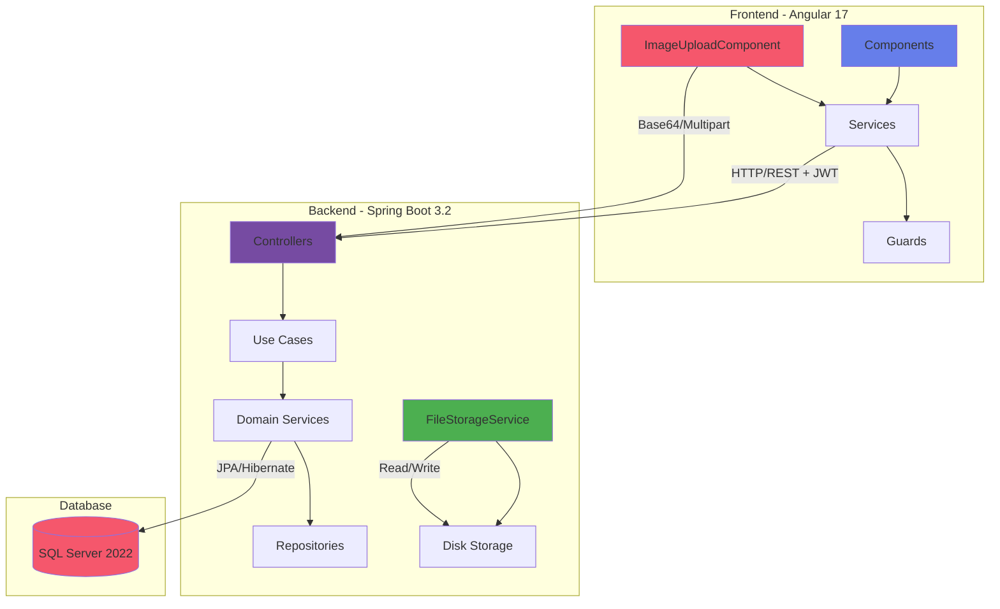

# 🎯 DigicampMonitoring


Application web de gestion des projets et des ressources pour le périmètre Digicamp. Elle permet de suivre les mouvements en termes de ressources, leur affectation aux différents projets internes et de générer des newsletters de projets en PDF.

## 📚 Documentation

- 🚀 **[Démarrage Rapide](./docs/QUICKSTART.md)** - Guide de démarrage en 5 minutes
- 📖 **[Guide Utilisateur](./docs/USER_GUIDE.md)** - Guide complet pour utiliser l'application
- 📘 **[Documentation Technique](./docs/TECHNICAL_DOCUMENTATION.md)** - Architecture, diagrammes et API
- 🎨 **[Guide de Style](./docs/STYLE_GUIDE.md)** - Design system et styles SCSS
- 🐳 **[Guide de Déploiement Docker](./docs/DOCKER_DEPLOYMENT.md)** - Déploiement avec Docker Compose
- 📸 **[Guide Upload d'Images](./docs/IMAGE_UPLOAD_GUIDE.md)** - Upload de logos et photos avec drag & drop
- 🔌 **[État des Endpoints API](./docs/API_ENDPOINTS_STATUS.md)** - Documentation complète des endpoints

## ✨ Fonctionnalités

### 🔐 Authentification
- ✅ Connexion / Inscription avec JWT
- ✅ Délégation de droits (à venir)
- ✅ Session sécurisée

### 📁 Gestion des Projets
- ✅ **CRUD complet** : Créer, Lire, Modifier, Supprimer
- ✅ **Upload de logo** : Drag & drop d'images (max 5MB)
  - Support multipart/form-data
  - Support Base64 depuis le frontend
  - Prévisualisation en temps réel
  - Validation côté client et serveur
- ✅ **Éditeur riche** : Description avec formatage (Quill)
- ✅ **Gestion des dates** : Date de début/fin avec calendrier
- ✅ **Statuts paramétrables** : En cours, Terminé, En pause, Annulé, Planifié
- ✅ **Recherche et filtres** : Par nom, statut, date
- ✅ **Affichage moderne** avec avatars et badges
- ✅ **Dialog de confirmation** pour les suppressions
- ✅ **Composant réutilisable** : ImageUploadComponent avec drag & drop

### 👥 Gestion des Collaborateurs
- ✅ **CRUD complet** : Gestion des collaborateurs
- ✅ **Upload de photo** : Drag & drop de photos professionnelles (max 5MB)
  - Zone de dépôt stylisée
  - Animation au survol
  - Compression automatique
  - Stockage optimisé
- ✅ **Informations détaillées** :
  - Nom, Prénom, Email professionnel
  - Grade : A4, A5, B1, B2, B3, C1, C2, C3
  - Poste : Développeur, Tech Lead, PO, QA, Scrum Master, etc.
  - Site : Casa, Rabat, Indifférent
- ✅ **Gestion des compétences** : Tags de skills techniques (Chips)
- ✅ **Disponibilité** : Toggle Disponible / Occupé
- ✅ **Recherche et filtres** : Multi-critères
- ✅ **Dialog de confirmation** pour les suppressions

### 📸 Système d'Upload d'Images
- ✅ **Composant moderne** : ImageUploadComponent standalone
  - Interface drag & drop élégante
  - Animations fluides (float, hover, scale)
  - Validation en temps réel (type, taille)
  - Prévisualisation immédiate
  - Suppression avec confirmation
- ✅ **Backend robuste** : FileStorageService
  - Support multipart et Base64
  - Validation MIME types
  - Génération de noms uniques (UUID)
  - Stockage local avec gestion de répertoires
  - Endpoints RESTful sécurisés
- ✅ **Types supportés** : JPG, PNG, GIF, SVG, WebP
- ✅ **Sécurité** : Validation taille, type, path traversal prevention

### 🔗 Affectation Ressources
- ✅ Affecter des collaborateurs aux projets
- ✅ Vue des disponibilités
- ✅ Expression des besoins par profil (grade, techno, site)
- ✅ Désaffectation automatique

### 📄 Newsletter PDF
- ✅ Génération automatique de newsletter
- ✅ Template professionnel incluant :
  - Logo et nom du projet
  - Description et objectifs
  - Collaborateurs avec photos
  - Compétences et besoins
- ✅ Export PDF prêt à partager

## 🏗️ Architecture



### Technologies

#### Backend
- **Java 17** - Langage de programmation
- **Spring Boot 3.2.0** - Framework backend
- **Spring Security** - Sécurité et authentification
- **JWT (JJWT 0.12.3)** - Tokens d'authentification
- **JPA/Hibernate** - ORM
- **SQL Server 2022** - Base de données
- **iText 7** - Génération PDF
- **Maven** - Gestion des dépendances
- **FileStorageService** - Gestion d'uploads avec support Base64

#### Frontend
- **Angular 17** - Framework frontend avec standalone components
- **TypeScript 5.2** - Langage
- **PrimeNG** - Bibliothèque UI moderne
  - Table, Dialog, Calendar, **Editor (Quill)**
  - **FileUpload**, Dropdown, Chips, Avatar
  - Button, Card, Tag, MenuBar, Toast
  - ConfirmDialog, ConfirmationService
- **Quill 1.3.7** - Éditeur de texte riche
- **RxJS** - Programmation réactive
- **SCSS** - Styles avec design system moderne
- **HTML5 Drag & Drop API** - Upload d'images moderne

#### DevOps
- **Docker & Docker Compose** - Conteneurisation
- **Git & GitHub** - Contrôle de version

## 🚀 Installation

### Prérequis
- **Docker Desktop** (recommandé)
- **Git**
- Node.js 18+ (pour développement local)
- Java 17+ (pour développement local)

### Installation Rapide avec Docker

```bash
# 1. Cloner le projet
git clone https://github.com/Soufiane4906/DigicampMonitoring.git
cd DigicampMonitoring

# 2. Démarrer tous les services
docker-compose up -d

# 3. Vérifier les logs
docker-compose logs -f

# 4. Accéder à l'application
# Frontend: http://localhost
# Backend API: http://localhost:8080
# SQL Server: localhost:1433
```

📖 **Pour plus de détails, consultez le [Guide de Déploiement Docker](./docs/DOCKER_DEPLOYMENT.md)**

### Installation Locale (Développement)

#### Backend
```bash
cd back
./mvnw clean install
./mvnw spring-boot:run
```

#### Frontend
```bash
cd front
npm install
npm start
# Application disponible sur http://localhost:4200
```

## 📖 Utilisation

### 1. Première Connexion

1. Ouvrez `http://localhost`
2. Créez un compte via **"S'inscrire"**
3. Connectez-vous avec vos identifiants

### 2. Dashboard

Le dashboard vous donne une vue d'ensemble :
- 📊 **Statistiques** : Nombre de projets et collaborateurs
- 🚀 **Actions rapides** : Accès direct aux fonctionnalités principales

### 3. Créer un Projet avec Logo

1. **Projets** → **Nouveau projet**
2. **Upload du logo** :
   - Glissez-déposez une image dans la zone prévue
   - OU cliquez pour sélectionner un fichier
   - Formats : JPG, PNG, SVG (max 5MB)
   - Prévisualisation instantanée
3. Remplissez les autres champs :
   - Nom du projet ⭐
   - Description/Objectifs ⭐ (éditeur riche Quill)
   - Date de début ⭐
   - Date de fin (optionnelle)
   - Statut ⭐
4. **Créer**

### 4. Ajouter un Collaborateur avec Photo

1. **Collaborateurs** → **Nouveau collaborateur**
2. **Upload de photo** :
   - Zone drag & drop avec animation
   - Aperçu en temps réel
   - Boutons d'édition/suppression au survol
3. Remplissez les informations :
   - Prénom & Nom ⭐
   - Email ⭐
   - Grade ⭐ (A4-C3)
   - Poste ⭐
   - Site ⭐ (Casa/Rabat/Indifférent)
   - Compétences (tags cliquables)
   - Disponibilité (toggle)
4. **Créer**

### 5. Affecter des Ressources

1. Ouvrez un **projet**
2. **Affecter collaborateur**
3. Sélectionnez les collaborateurs disponibles
4. **Affecter**

### 6. Générer une Newsletter

1. Ouvrez un **projet**
2. **Générer newsletter**
3. Le PDF se télécharge automatiquement avec :
   - Logo du projet
   - Photos des collaborateurs
   - Compétences formatées

📖 **Pour un guide détaillé, consultez le [Guide Utilisateur](./docs/USER_GUIDE.md)**

## 🎨 Design System

### Couleurs Principales

| Couleur | Hex | Usage |
|---------|-----|-------|
| Primary Purple | `#667eea` | Boutons, liens, headers |
| Secondary Purple | `#764ba2` | Gradients, accents |
| Pink | `#f5576c` | Collaborateurs, dangers |
| Success | `#4CAF50` | États de succès |
| Warning | `#FF9800` | Avertissements |
| Info | `#2196F3` | Informations |
| Gray 100 | `#f9fafb` | Backgrounds clairs |
| Gray 300 | `#d1d5db` | Bordures |

### Gradients Signature

```scss
// Primary Gradient
background: linear-gradient(135deg, #667eea 0%, #764ba2 100%);

// Secondary Gradient
background: linear-gradient(135deg, #f093fb 0%, #f5576c 100%);

// Background Gradient
background: linear-gradient(135deg, #f5f7fa 0%, #c3cfe2 100%);

// Upload Zone Gradient
background: linear-gradient(135deg, #f9fafb 0%, #f3f4f6 100%);
```

### Animations

```scss
// Float Animation (Upload Icon)
@keyframes float {
  0%, 100% { transform: translateY(0px); }
  50% { transform: translateY(-10px); }
}

// Hover Effects
.drop-zone:hover {
  transform: translateY(-2px);
  box-shadow: 0 10px 25px -5px rgba(102, 126, 234, 0.1);
}
```

🎨 **Pour plus de détails, consultez le [Guide de Style](./docs/STYLE_GUIDE.md)**

## 📊 Structure du Projet

```
DigicampMonitoring/
├── back/                          # Backend Spring Boot
│   ├── src/main/java/com/digicamp/monitoring/
│   │   ├── application/service/
│   │   │   └── FileStorageService.java        # Interface upload
│   │   ├── domain/model/
│   │   │   ├── Project.java                   # +logoUrl
│   │   │   └── Collaborator.java              # +photoUrl
│   │   ├── infrastructure/
│   │   │   ├── config/
│   │   │   │   └── StorageProperties.java     # Config upload
│   │   │   └── service/
│   │   │       └── FileStorageServiceImpl.java # Implémentation
│   │   └── presentation/
│   │       ├── controller/
│   │       │   └── FileController.java        # Endpoints upload
│   │       └── dto/
│   │           ├── project/ProjectRequest.java  # +logoBase64
│   │           └── collaborator/CollaboratorRequest.java # +photoBase64
│   └── pom.xml
├── front/                         # Frontend Angular
│   ├── src/app/
│   │   ├── core/                  # Services, Guards, Models
│   │   ├── features/              # Feature Modules
│   │   │   ├── authentication/    # Login, Register
│   │   │   ├── dashboard/         # Dashboard
│   │   │   ├── projects/          # Projects + Dialogs
│   │   │   │   └── components/
│   │   │   │       └── project-form-dialog/    # CRUD + Upload
│   │   │   └── collaborators/     # Collaborators + Dialogs
│   │   │       └── components/
│   │   │           └── collaborator-form-dialog/ # CRUD + Upload
│   │   └── shared/                # Shared Components
│   │       └── components/
│   │           └── image-upload/
│   │               └── image-upload.component.ts # Composant Upload
│   └── package.json
├── docs/                          # Documentation
│   ├── QUICKSTART.md             # Démarrage rapide
│   ├── TECHNICAL_DOCUMENTATION.md # Doc technique avec diagrammes
│   ├── USER_GUIDE.md             # Guide utilisateur complet
│   ├── STYLE_GUIDE.md            # Guide de style SCSS
│   ├── DOCKER_DEPLOYMENT.md      # Guide Docker
│   ├── IMAGE_UPLOAD_GUIDE.md     # 🆕 Guide upload d'images
│   └── API_ENDPOINTS_STATUS.md   # 🆕 État des endpoints (17/32)
├── uploads/                       # 🆕 Fichiers uploadés (gitignore)
│   ├── projects/                  # Logos de projets
│   └── collaborators/             # Photos de collaborateurs
├── docker-compose.yml            # Configuration Docker
└── README.md                     # Ce fichier
```

## 🔒 Sécurité

### Authentification JWT

- **Token** généré à la connexion
- **Durée de vie** : 24 heures
- **Stockage** : localStorage
- **Refresh** : Automatique
- **Endpoints protégés** : Tous sauf `/api/auth/*` et `GET /api/files/**`

### Sécurité des Uploads

- **Validation MIME types** : Uniquement images autorisées
- **Taille maximale** : 5MB (configurable)
- **Noms uniques** : UUID pour éviter les collisions
- **Path traversal prevention** : Validation des chemins
- **Sanitization** : Nettoyage des noms de fichiers
- **Stockage isolé** : Répertoires séparés par type

### Sécurité des Données

- **Mots de passe hashés** : bcrypt
- **CORS configuré** : localhost uniquement
- **Validation** : Frontend + Backend
- **SQL Injection** : Protection JPA/Hibernate

## 📡 API Endpoints

### Authentification
```http
POST   /api/auth/login          # Connexion
POST   /api/auth/register       # Inscription
GET    /api/auth/me             # Utilisateur courant
```

### Projets
```http
GET    /api/projects?page=0&size=10    # Liste paginée
POST   /api/projects                    # Créer (+ logoBase64)
GET    /api/projects/{id}               # Détails
PUT    /api/projects/{id}               # Modifier
DELETE /api/projects/{id}               # Supprimer
POST   /api/projects/{id}/collaborators # Affecter collaborateurs
POST   /api/projects/{id}/newsletter    # Générer newsletter
```

### Collaborateurs
```http
GET    /api/collaborators?page=0&size=10&available=true  # Liste
POST   /api/collaborators                                 # Créer (+ photoBase64)
GET    /api/collaborators/{id}                           # Détails
PUT    /api/collaborators/{id}                           # Modifier
DELETE /api/collaborators/{id}                           # Supprimer
```

### 🆕 Fichiers/Upload
```http
POST   /api/files/upload/image           # Upload multipart
POST   /api/files/upload/base64          # Upload Base64
GET    /api/files/{directory}/{filename} # Récupérer image (public)
DELETE /api/files/{directory}/{filename} # Supprimer image
```

📘 **Pour plus de détails :**
- [Documentation Technique](./docs/TECHNICAL_DOCUMENTATION.md)
- [Guide Upload d'Images](./docs/IMAGE_UPLOAD_GUIDE.md)
- [État des Endpoints API](./docs/API_ENDPOINTS_STATUS.md) - **17/32 endpoints implémentés (53%)**

## 🧪 Tests

### Backend
```bash
cd back
./mvnw test
```

### Frontend
```bash
cd front
npm test
npm run e2e
```

## 🐛 Dépannage

### Docker

**Problème : Les conteneurs ne démarrent pas**
```bash
# Arrêter et nettoyer
docker-compose down -v

# Rebuild et redémarrer
docker-compose up -d --build
```

**Problème : Base de données non créée**
```bash
# Vérifier les logs du service db-init
docker-compose logs db-init

# Recréer la base manuellement
docker exec -it digicampmonitoring-sqlserver-1 /opt/mssql-tools18/bin/sqlcmd \
  -S localhost -U sa -P "YourStrong@Passw0rd" -C \
  -Q "CREATE DATABASE digicampdb"
```

### Frontend

**Problème : CORS Error**
- Vérifiez que le backend est démarré
- Vérifiez `SecurityConfiguration.java` pour les origines autorisées

**Problème : Module not found**
```bash
cd front
rm -rf node_modules package-lock.json
npm install
```

### Backend

**Problème : Port 8080 déjà utilisé**
```bash
# Trouver le processus
lsof -i :8080

# Ou changer le port dans application.yml
server.port=8081
```

**Problème : Uploads échouent**
```bash
# Vérifier les permissions du répertoire uploads
mkdir -p uploads/projects uploads/collaborators
chmod -R 755 uploads/
```

🐛 **Pour plus de solutions, consultez le [Guide de Déploiement Docker](./docs/DOCKER_DEPLOYMENT.md#-dépannage)**

## 🤝 Contribution

1. Fork le projet
2. Créer une branche (`git checkout -b feature/AmazingFeature`)
3. Commit les changements (`git commit -m 'Add AmazingFeature'`)
4. Push vers la branche (`git push origin feature/AmazingFeature`)
5. Ouvrir une Pull Request

### Guidelines

- Suivez le [Guide de Style](./docs/STYLE_GUIDE.md)
- Ajoutez des tests pour les nouvelles fonctionnalités
- Mettez à jour la documentation si nécessaire
- Utilisez des messages de commit clairs et descriptifs

## 📝 Roadmap

### ✅ Version 1.0 (Actuel)
- [x] CRUD Projets avec upload de logo
- [x] CRUD Collaborateurs avec upload de photo
- [x] Composant ImageUpload réutilisable
- [x] FileStorageService avec support Base64
- [x] Documentation complète (7 guides)

### 🚧 Version 1.1 (En cours - 53% complété)
- [x] Upload d'images avec drag & drop
- [x] Système de fichiers Backend
- [ ] Endpoints Project Status (2)
- [ ] Endpoints Project Assignments (5)
- [ ] Endpoints Project Needs (5)
- [ ] Dashboard & Statistiques (3)
- [ ] Templates de newsletter personnalisables
- [ ] Import/Export CSV de collaborateurs

### 🔮 Version 2.0 (Futur)
- [ ] Délégation de droits EM
- [ ] Notifications en temps réel
- [ ] Mode sombre
- [ ] Multi-tenancy
- [ ] Gestion des congés
- [ ] Planning Gantt
- [ ] API publique avec Swagger
- [ ] Application mobile

## 📄 Licence

Ce projet est privé et destiné uniquement à un usage interne Digicamp.

## 👥 Auteurs

- **Engineering Manager** - Digicamp
- **Développeur** - [@Soufiane4906](https://github.com/Soufiane4906)

## 🙏 Remerciements

- Spring Boot team
- Angular team
- PrimeNG team
- Quill.js team
- La communauté open source

---

## 📞 Support

Pour toute question ou assistance :

- 📧 **Email** : support@digicamp.com
- 📚 **Documentation** : [docs/](./docs/)
- 🐛 **Issues** : [GitHub Issues](https://github.com/Soufiane4906/DigicampMonitoring/issues)

---

<div align="center">
  <strong>Fait avec ❤️ pour Digicamp</strong>
  <br>
  <sub>Version 1.0.0 - 12 octobre 2025</sub>
  <br>
  <sub>🆕 Nouveau : Upload d'images avec drag & drop moderne</sub>
</div>
