# 🐳 Guide de Déploiement Docker

Guide complet pour déployer DigicampMonitoring avec Docker et Docker Compose.

---

## 📋 Table des Matières

- [Prérequis](#-prérequis)
- [Architecture Docker](#-architecture-docker)
- [Configuration](#️-configuration)
- [Déploiement](#-déploiement)
- [Gestion des Services](#-gestion-des-services)
- [Mise à Jour](#-mise-à-jour)
- [Dépannage](#-dépannage)
- [Production](#-production)

---

## 🔧 Prérequis

### Logiciels Requis

- **Docker** : Version 20.10 ou supérieure
- **Docker Compose** : Version 2.0 ou supérieure
- **Git** : Pour cloner le repository

### Installation Docker

#### Windows
```bash
# Télécharger Docker Desktop depuis docker.com
# Installer et démarrer Docker Desktop
docker --version
docker-compose --version
```

#### Linux (Ubuntu/Debian)
```bash
# Installer Docker
curl -fsSL https://get.docker.com -o get-docker.sh
sudo sh get-docker.sh

# Installer Docker Compose
sudo apt-get install docker-compose-plugin

# Ajouter votre utilisateur au groupe docker
sudo usermod -aG docker $USER
newgrp docker
```

#### macOS
```bash
# Télécharger Docker Desktop depuis docker.com
# Installer et démarrer Docker Desktop
docker --version
docker-compose --version
```

---

## 🏗️ Architecture Docker

### Services Conteneurisés

```mermaid
graph TB
    subgraph "Docker Network"
        Frontend[Angular Frontend<br/>Port 4200]
        Backend[Spring Boot Backend<br/>Port 8080]
        Database[(PostgreSQL<br/>Port 5432)]
        
        Frontend -->|API Requests| Backend
        Backend -->|JDBC| Database
    end
    
    User[👤 Utilisateur] -->|HTTP| Frontend
    
    style Frontend fill:#667eea
    style Backend fill:#f5576c
    style Database fill:#764ba2
```



### Structure des Fichiers Docker

```
DigicampMonitoring/
├── docker-compose.yml          # Configuration multi-services
├── front/
│   ├── Dockerfile             # Image Angular
│   └── nginx.conf             # Configuration Nginx
└── backend/
    └── Dockerfile             # Image Spring Boot
```

---

## ⚙️ Configuration

### 1. Variables d'Environnement

Créez un fichier `.env` à la racine :

```env
# Database Configuration
POSTGRES_DB=digicampdb
POSTGRES_USER=digicampuser
POSTGRES_PASSWORD=ChangeMe123!
DB_HOST=postgres
DB_PORT=5432

# Backend Configuration
SPRING_PROFILES_ACTIVE=prod
JWT_SECRET=VotreCleSecreteTresTresLongueEtSecurisee2024
JWT_EXPIRATION=86400000

# Frontend Configuration
API_URL=http://localhost:8080/api

# Ports
FRONTEND_PORT=4200
BACKEND_PORT=8080
DATABASE_PORT=5432
```

### 2. Configuration Docker Compose

**docker-compose.yml** :

```yaml
version: '3.8'

services:
  # PostgreSQL Database
  postgres:
    image: postgres:15-alpine
    container_name: digicampdb
    environment:
      POSTGRES_DB: ${POSTGRES_DB}
      POSTGRES_USER: ${POSTGRES_USER}
      POSTGRES_PASSWORD: ${POSTGRES_PASSWORD}
    volumes:
      - postgres_data:/var/lib/postgresql/data
      - ./init-db.sql:/docker-entrypoint-initdb.d/init.sql
    ports:
      - "${DATABASE_PORT}:5432"
    networks:
      - digicamp-network
    healthcheck:
      test: ["CMD-SHELL", "pg_isready -U ${POSTGRES_USER}"]
      interval: 10s
      timeout: 5s
      retries: 5

  # Spring Boot Backend
  backend:
    build:
      context: ./backend
      dockerfile: Dockerfile
    container_name: digicamp-backend
    environment:
      SPRING_PROFILES_ACTIVE: ${SPRING_PROFILES_ACTIVE}
      SPRING_DATASOURCE_URL: jdbc:postgresql://${DB_HOST}:${DB_PORT}/${POSTGRES_DB}
      SPRING_DATASOURCE_USERNAME: ${POSTGRES_USER}
      SPRING_DATASOURCE_PASSWORD: ${POSTGRES_PASSWORD}
      JWT_SECRET: ${JWT_SECRET}
      JWT_EXPIRATION: ${JWT_EXPIRATION}
    ports:
      - "${BACKEND_PORT}:8080"
    depends_on:
      postgres:
        condition: service_healthy
    networks:
      - digicamp-network
    healthcheck:
      test: ["CMD", "curl", "-f", "http://localhost:8080/actuator/health"]
      interval: 30s
      timeout: 10s
      retries: 3
    restart: unless-stopped

  # Angular Frontend
  frontend:
    build:
      context: ./front
      dockerfile: Dockerfile
      args:
        API_URL: ${API_URL}
    container_name: digicamp-frontend
    ports:
      - "${FRONTEND_PORT}:80"
    depends_on:
      - backend
    networks:
      - digicamp-network
    restart: unless-stopped

volumes:
  postgres_data:
    driver: local

networks:
  digicamp-network:
    driver: bridge
```

### 3. Dockerfile Frontend

**front/Dockerfile** :

```dockerfile
# Stage 1: Build Angular app
FROM node:20-alpine AS build

WORKDIR /app

# Copy package files
COPY package*.json ./

# Install dependencies
RUN npm ci --legacy-peer-deps

# Copy source code
COPY . .

# Build for production
RUN npm run build -- --configuration production

# Stage 2: Serve with Nginx
FROM nginx:alpine

# Copy custom nginx config
COPY nginx.conf /etc/nginx/nginx.conf

# Copy built app from build stage
COPY --from=build /app/dist/digicamp-monitoring /usr/share/nginx/html

# Expose port 80
EXPOSE 80

CMD ["nginx", "-g", "daemon off;"]
```

**front/nginx.conf** :

```nginx
events {
    worker_connections 1024;
}

http {
    include /etc/nginx/mime.types;
    default_type application/octet-stream;

    server {
        listen 80;
        server_name localhost;
        root /usr/share/nginx/html;
        index index.html;

        # Gzip compression
        gzip on;
        gzip_types text/plain text/css application/json application/javascript text/xml application/xml;

        # Angular routing
        location / {
            try_files $uri $uri/ /index.html;
        }

        # API proxy
        location /api {
            proxy_pass http://backend:8080;
            proxy_set_header Host $host;
            proxy_set_header X-Real-IP $remote_addr;
            proxy_set_header X-Forwarded-For $proxy_add_x_forwarded_for;
            proxy_set_header X-Forwarded-Proto $scheme;
        }

        # Cache static assets
        location ~* \.(jpg|jpeg|png|gif|ico|css|js|woff|woff2|ttf|svg)$ {
            expires 1y;
            add_header Cache-Control "public, immutable";
        }
    }
}
```

### 4. Dockerfile Backend

**backend/Dockerfile** :

```dockerfile
# Stage 1: Build with Maven
FROM maven:3.9-eclipse-temurin-17 AS build

WORKDIR /app

# Copy pom.xml
COPY pom.xml .

# Download dependencies
RUN mvn dependency:go-offline -B

# Copy source code
COPY src ./src

# Build application
RUN mvn clean package -DskipTests

# Stage 2: Run with JRE
FROM eclipse-temurin:17-jre-alpine

WORKDIR /app

# Copy JAR from build stage
COPY --from=build /app/target/*.jar app.jar

# Create non-root user
RUN addgroup -S spring && adduser -S spring -G spring
USER spring:spring

# Expose port
EXPOSE 8080

# Health check
HEALTHCHECK --interval=30s --timeout=10s --retries=3 \
  CMD wget --quiet --tries=1 --spider http://localhost:8080/actuator/health || exit 1

# Run application
ENTRYPOINT ["java", "-jar", "app.jar"]
```

---

## 🚀 Déploiement

### 1. Premier Déploiement

```bash
# Cloner le repository
git clone https://github.com/Soufiane4906/DigicampMonitoring.git
cd DigicampMonitoring

# Créer le fichier .env
cp .env.example .env
nano .env  # Modifier les variables

# Construire et démarrer tous les services
docker-compose up -d --build
```

### 2. Vérifier le Déploiement

```bash
# Voir les logs de tous les services
docker-compose logs -f

# Voir les logs d'un service spécifique
docker-compose logs -f frontend
docker-compose logs -f backend
docker-compose logs -f postgres

# Vérifier le statut des conteneurs
docker-compose ps
```

### 3. Accéder à l'Application

- **Frontend** : http://localhost:4200
- **Backend API** : http://localhost:8080/api
- **Backend Health** : http://localhost:8080/actuator/health
- **Swagger UI** : http://localhost:8080/swagger-ui.html

---

## 🔄 Gestion des Services

### Démarrer les Services

```bash
# Démarrer tous les services
docker-compose start

# Démarrer un service spécifique
docker-compose start frontend
```

### Arrêter les Services

```bash
# Arrêter tous les services
docker-compose stop

# Arrêter un service spécifique
docker-compose stop backend
```

### Redémarrer les Services

```bash
# Redémarrer tous les services
docker-compose restart

# Redémarrer un service spécifique
docker-compose restart postgres
```

### Arrêter et Supprimer

```bash
# Arrêter et supprimer les conteneurs
docker-compose down

# Arrêter et supprimer les conteneurs + volumes
docker-compose down -v

# Arrêter et supprimer tout (conteneurs, volumes, images)
docker-compose down -v --rmi all
```

---

## 🔄 Mise à Jour

### Mise à Jour de l'Application

```bash
# Récupérer les dernières modifications
git pull origin main

# Reconstruire et redémarrer
docker-compose down
docker-compose up -d --build

# Ou avec une seule commande
docker-compose up -d --build --force-recreate
```

### Mise à Jour d'un Service Spécifique

```bash
# Reconstruire uniquement le frontend
docker-compose build frontend
docker-compose up -d frontend

# Reconstruire uniquement le backend
docker-compose build backend
docker-compose up -d backend
```

---

## 🐛 Dépannage

### Problème : Le Frontend ne Démarre Pas

```bash
# Vérifier les logs
docker-compose logs frontend

# Solution : Reconstruire l'image
docker-compose down
docker-compose build --no-cache frontend
docker-compose up -d
```

### Problème : Erreur de Connexion à la Base de Données

```bash
# Vérifier que PostgreSQL est prêt
docker-compose exec postgres pg_isready

# Se connecter à la base de données
docker-compose exec postgres psql -U digicampuser -d digicampdb

# Vérifier les variables d'environnement du backend
docker-compose exec backend env | grep SPRING_DATASOURCE
```

### Problème : Port Déjà Utilisé

```bash
# Trouver le processus utilisant le port 4200
lsof -i :4200  # macOS/Linux
netstat -ano | findstr :4200  # Windows

# Modifier le port dans .env
FRONTEND_PORT=4201

# Redémarrer
docker-compose down
docker-compose up -d
```

### Problème : Manque d'Espace Disque

```bash
# Nettoyer les images non utilisées
docker system prune -a

# Nettoyer les volumes non utilisés
docker volume prune

# Voir l'utilisation de l'espace
docker system df
```

### Problème : CORS Errors

Vérifier la configuration du backend dans `application.properties` :

```properties
# Autoriser le frontend
allowed.origins=http://localhost:4200,http://localhost:80
```

---

## 🏭 Production

### Optimisations pour la Production

#### 1. Configuration Nginx (Production)

```nginx
# Activer SSL/TLS
server {
    listen 443 ssl http2;
    server_name votre-domaine.com;

    ssl_certificate /etc/nginx/ssl/cert.pem;
    ssl_certificate_key /etc/nginx/ssl/key.pem;
    ssl_protocols TLSv1.2 TLSv1.3;
    ssl_ciphers HIGH:!aNULL:!MD5;

    # Headers de sécurité
    add_header X-Frame-Options "SAMEORIGIN" always;
    add_header X-Content-Type-Options "nosniff" always;
    add_header X-XSS-Protection "1; mode=block" always;
    add_header Referrer-Policy "no-referrer-when-downgrade" always;

    # ... reste de la configuration
}
```

#### 2. Variables d'Environnement Production

```env
SPRING_PROFILES_ACTIVE=prod
JWT_SECRET=GenerezUneCleAleatoireTresLongueEtComplexe
POSTGRES_PASSWORD=MotDePasseTresComplexeEtSecurise123!@#
```

#### 3. Docker Compose Production

```yaml
services:
  backend:
    restart: always
    deploy:
      resources:
        limits:
          cpus: '2'
          memory: 2G
        reservations:
          cpus: '1'
          memory: 1G
    logging:
      driver: "json-file"
      options:
        max-size: "10m"
        max-file: "3"
```

### Backup de la Base de Données

```bash
# Créer un backup
docker-compose exec postgres pg_dump -U digicampuser digicampdb > backup.sql

# Restaurer un backup
docker-compose exec -T postgres psql -U digicampuser digicampdb < backup.sql
```

### Monitoring

```bash
# Voir les statistiques en temps réel
docker stats

# Voir l'utilisation des ressources
docker-compose top
```

---

## 📊 Commandes Utiles

| Commande | Description |
|----------|-------------|
| `docker-compose up -d` | Démarrer en arrière-plan |
| `docker-compose logs -f [service]` | Voir les logs en temps réel |
| `docker-compose ps` | Liste des conteneurs |
| `docker-compose exec [service] sh` | Ouvrir un shell dans un conteneur |
| `docker-compose build --no-cache` | Reconstruire sans cache |
| `docker-compose down -v` | Tout supprimer (avec volumes) |
| `docker system prune -a` | Nettoyer Docker |

---

## 🔗 Ressources

- [Documentation Docker](https://docs.docker.com/)
- [Documentation Docker Compose](https://docs.docker.com/compose/)
- [Best Practices Docker](https://docs.docker.com/develop/dev-best-practices/)
- [Guide de Sécurité Docker](https://docs.docker.com/engine/security/)

---

## 📞 Support

Pour toute question ou problème :

- **GitHub Issues** : [Créer une issue](https://github.com/Soufiane4906/DigicampMonitoring/issues)
- **Documentation** : Voir les autres guides dans `/docs`
- **Email** : support@digicamp.com

---

**Bon déploiement ! 🚀**
