# 📁 Upload d'Images - Guide Complet

## Vue d'ensemble

Ce guide décrit l'implémentation complète du système d'upload d'images pour le projet DigicampMonitoring, incluant l'upload de logos de projets et de photos de collaborateurs.

## 📋 Table des matières

1. [Architecture](#architecture)
2. [Endpoints Backend](#endpoints-backend)
3. [Composant Frontend](#composant-frontend)
4. [Configuration](#configuration)
5. [Utilisation](#utilisation)
6. [Sécurité](#sécurité)

---

## 🏗️ Architecture

### Stack Technique

**Backend:**
- Spring Boot 3.2
- MultipartFile pour uploads classiques
- Support Base64 pour uploads depuis le frontend
- Stockage local avec FileStorageService

**Frontend:**
- Angular 17 Standalone Components
- PrimeNG pour l'UI
- Drag & Drop natif HTML5
- Composant réutilisable `ImageUploadComponent`

### Flux de Données

```mermaid
sequenceDiagram
    participant U as Utilisateur
    participant F as Frontend<br/>(Angular)
    participant I as ImageUploadComponent
    participant B as Backend<br/>(Spring Boot)
    participant FS as FileStorageService
    participant D as Disque

    U->>F: Glisse/Sélectionne image
    F->>I: onFileSelect(file)
    I->>I: Convertir en Base64
    I->>F: Émettre événement imageSelected
    F->>B: POST /api/files/upload/base64
    B->>FS: storeBase64Image(data)
    FS->>D: Écrire fichier
    D-->>FS: Chemin fichier
    FS-->>B: Retour chemin
    B-->>F: { filePath, url }
    F->>F: Mettre à jour modèle
    F-->>U: Afficher aperçu
```



---

## 🔌 Endpoints Backend

### 1. Upload d'Image (Multipart)

**Endpoint:** `POST /api/files/upload/image`

**Headers:**
```http
Content-Type: multipart/form-data
Authorization: Bearer <token>
```

**Paramètres:**
- `file` (required): Fichier image
- `directory` (optional): Répertoire de destination (default: "images")

**Réponse Success (200):**
```json
{
  "filePath": "images/uuid-12345.jpg",
  "url": "/api/files/images/uuid-12345.jpg",
  "message": "File uploaded successfully"
}
```

**Exemple cURL:**
```bash
curl -X POST http://localhost:8080/api/files/upload/image \
  -H "Authorization: Bearer YOUR_TOKEN" \
  -F "file=@logo.png" \
  -F "directory=projects/logos"
```

---

### 2. Upload d'Image Base64

**Endpoint:** `POST /api/files/upload/base64`

**Headers:**
```http
Content-Type: application/json
Authorization: Bearer <token>
```

**Body:**
```json
{
  "base64Data": "data:image/png;base64,iVBORw0KGgo...",
  "fileName": "project-logo",
  "directory": "projects"
}
```

**Réponse Success (200):**
```json
{
  "filePath": "projects/project-logo_uuid-12345.png",
  "url": "/api/files/projects/project-logo_uuid-12345.png",
  "message": "Image uploaded successfully"
}
```

**Exemple cURL:**
```bash
curl -X POST http://localhost:8080/api/files/upload/base64 \
  -H "Authorization: Bearer YOUR_TOKEN" \
  -H "Content-Type: application/json" \
  -d '{
    "base64Data": "data:image/png;base64,iVBORw0KGgoAAAANS...",
    "fileName": "collaborator-photo",
    "directory": "collaborators"
  }'
```

---

### 3. Récupérer une Image

**Endpoint:** `GET /api/files/{directory}/{filename}`

**Exemple:**
```
GET /api/files/projects/logo_uuid-12345.png
```

**Réponse:** Fichier image avec Content-Type approprié

**Exemples d'utilisation:**
```html
<!-- Dans un template Angular -->


<!-- Dans un tag img HTML -->

```

---

### 4. Supprimer une Image

**Endpoint:** `DELETE /api/files/{directory}/{filename}`

**Headers:**
```http
Authorization: Bearer <token>
```

**Réponse Success (200):**
```json
{
  "message": "File deleted successfully"
}
```

---

## 🎨 Composant Frontend

### ImageUploadComponent

Composant standalone réutilisable avec drag & drop.

**Emplacement:** `front/src/app/shared/components/image-upload/image-upload.component.ts`

#### Inputs

| Propriété | Type | Défaut | Description |
|-----------|------|--------|-------------|
| `label` | string | "Télécharger une image" | Libellé affiché |
| `accept` | string | "image/*" | Types de fichiers acceptés |
| `maxSizeMB` | number | 2 | Taille maximale en MB |
| `imagePreview` | string | "" | URL ou Base64 de l'aperçu |

#### Outputs

| Événement | Payload | Description |
|-----------|---------|-------------|
| `imageSelected` | `{ file: File, preview: string }` | Image sélectionnée |
| `imageRemoved` | `void` | Image supprimée |

#### Utilisation

```typescript
// Dans votre component.ts
import { ImageUploadComponent } from '@shared/components/image-upload/image-upload.component';

@Component({
  selector: 'app-project-form',
  standalone: true,
  imports: [ImageUploadComponent],
  template: `
    <app-image-upload
      label="Logo du projet"
      [maxSizeMB]="5"
      [imagePreview]="logoPreview"
      (imageSelected)="onLogoSelected($event)"
      (imageRemoved)="onLogoRemoved()">
    </app-image-upload>
  `
})
export class ProjectFormComponent {
  logoPreview = '';

  onLogoSelected(event: { file: File; preview: string }): void {
    this.logoPreview = event.preview;
    // Envoyer au backend ou stocker localement
  }

  onLogoRemoved(): void {
    this.logoPreview = '';
  }
}
```

---

## ⚙️ Configuration

### Backend (application.yml)

```yaml
spring:
  servlet:
    multipart:
      max-file-size: 10MB
      max-request-size: 10MB
      enabled: true

app:
  storage:
    location: uploads                    # Répertoire de stockage
    max-file-size: 5                    # Taille max en MB
    allowed-image-types:
      - image/jpeg
      - image/jpg
      - image/png
      - image/gif
      - image/svg+xml
      - image/webp
```

### Frontend (environment.ts)

```typescript
export const environment = {
  production: false,
  apiUrl: 'http://localhost:8080/api',
  fileUploadUrl: 'http://localhost:8080/api/files'
};
```

---

## 📝 Utilisation Complète

### 1. Upload depuis le Frontend (Projets)

```typescript
// project-form-dialog.component.ts
import { ImageUploadComponent } from '@shared/components/image-upload/image-upload.component';
import { HttpClient } from '@angular/common/http';

export class ProjectFormDialogComponent {
  private http = inject(HttpClient);
  logoPreview = '';
  logoBase64 = '';

  onLogoSelected(event: { file: File; preview: string }): void {
    this.logoPreview = event.preview;
    this.logoBase64 = event.preview;
  }

  onSubmit(): void {
    const projectData = {
      name: this.projectForm.value.name,
      description: this.projectForm.value.description,
      logoBase64: this.logoBase64, // Envoyé au backend
      // ... autres champs
    };

    this.http.post('/api/projects', projectData).subscribe({
      next: (response) => console.log('Project created:', response),
      error: (error) => console.error('Error:', error)
    });
  }
}
```

### 2. Traitement Backend (ProjectService)

```java
@Service
@RequiredArgsConstructor
public class ProjectServiceImpl implements ProjectService {
    
    private final FileStorageService fileStorageService;
    private final ProjectRepository projectRepository;

    @Override
    @Transactional
    public ProjectResponse createProject(ProjectRequest request) {
        // Gérer l'upload du logo
        String logoUrl = null;
        if (request.getLogoBase64() != null && !request.getLogoBase64().isEmpty()) {
            logoUrl = fileStorageService.storeBase64Image(
                request.getLogoBase64(),
                "project-logo",
                "projects/logos"
            );
        }

        // Créer le projet
        Project project = Project.builder()
                .name(request.getName())
                .logoUrl(logoUrl)
                .description(request.getDescription())
                // ... autres champs
                .build();

        project = projectRepository.save(project);
        return mapToResponse(project);
    }

    @Override
    @Transactional
    public void deleteProject(Long id) {
        Project project = findProjectById(id);
        
        // Supprimer le logo si existe
        if (project.getLogoUrl() != null) {
            fileStorageService.deleteFile(project.getLogoUrl());
        }
        
        projectRepository.delete(project);
    }
}
```

### 3. Affichage des Images

```html
<!-- project-list.component.html -->
<p-table [value]="projects">
  <ng-template pTemplate="body" let-project>
    <tr>
      <td>
        @if (project.logoUrl) {
          
        } @else {
          <i class="pi pi-image placeholder-icon"></i>
        }
      </td>
      <td>{{ project.name }}</td>
    </tr>
  </ng-template>
</p-table>
```

```scss
// Styles pour l'affichage
.project-logo {
  width: 50px;
  height: 50px;
  object-fit: cover;
  border-radius: 8px;
  border: 2px solid #e9ecef;
}

.placeholder-icon {
  font-size: 2rem;
  color: #d1d5db;
}
```

---

## 🔒 Sécurité

### 1. Validation Côté Backend

```java
@Service
public class FileStorageServiceImpl implements FileStorageService {
    
    @Override
    public String storeBase64Image(String base64Data, String fileName, String directory) {
        // 1. Valider le format Base64
        if (!isValidBase64(base64Data)) {
            throw new IllegalArgumentException("Invalid Base64 format");
        }

        // 2. Extraire et valider le type MIME
        String mimeType = extractMimeType(base64Data);
        if (!isAllowedMimeType(mimeType)) {
            throw new IllegalArgumentException("Image type not allowed: " + mimeType);
        }

        // 3. Décoder et vérifier la taille
        byte[] imageBytes = Base64.getDecoder().decode(extractBase64Data(base64Data));
        if (imageBytes.length > maxFileSize * 1024 * 1024) {
            throw new IllegalArgumentException("File size exceeds limit");
        }

        // 4. Générer un nom unique
        String filename = UUID.randomUUID().toString() + getExtension(mimeType);

        // 5. Stocker le fichier
        // ... code de stockage
    }
}
```

### 2. Validation Côté Frontend

```typescript
// image-upload.component.ts
handleFile(file: File): void {
  // Vérifier le type
  if (!file.type.startsWith('image/')) {
    this.showError('Veuillez sélectionner une image valide');
    return;
  }

  // Vérifier la taille
  const maxSizeBytes = this.maxSizeMB * 1024 * 1024;
  if (file.size > maxSizeBytes) {
    this.showError(`La taille ne doit pas dépasser ${this.maxSizeMB}MB`);
    return;
  }

  // Lire le fichier
  const reader = new FileReader();
  reader.onload = (e: ProgressEvent<FileReader>) => {
    const preview = e.target?.result as string;
    this.imageSelected.emit({ file, preview });
  };
  reader.readAsDataURL(file);
}
```

### 3. Protection des Endpoints

```java
@Configuration
@EnableMethodSecurity
public class SecurityConfiguration {
    
    @Bean
    public SecurityFilterChain filterChain(HttpSecurity http) throws Exception {
        http
            .authorizeHttpRequests(auth -> auth
                // Lecture publique des images
                .requestMatchers(GET, "/api/files/**").permitAll()
                
                // Upload/Suppression nécessitent authentification
                .requestMatchers(POST, "/api/files/**").authenticated()
                .requestMatchers(DELETE, "/api/files/**").authenticated()
                
                .anyRequest().authenticated()
            );
        return http.build();
    }
}
```

### 4. Prévention des Attaques

**Path Traversal:**
```java
private void validateFilePath(String filePath) {
    Path normalizedPath = Paths.get(filePath).normalize();
    if (!normalizedPath.startsWith(rootLocation)) {
        throw new SecurityException("Invalid file path");
    }
}
```

**Injection de Code:**
```java
private String sanitizeFileName(String filename) {
    return filename.replaceAll("[^a-zA-Z0-9._-]", "_");
}
```

---

## 🧪 Tests

### Test Backend (FileStorageServiceTest)

```java
@SpringBootTest
class FileStorageServiceTest {

    @Autowired
    private FileStorageService fileStorageService;

    @Test
    void shouldStoreBase64Image() {
        String base64 = "data:image/png;base64,iVBORw0KGgo...";
        String filePath = fileStorageService.storeBase64Image(base64, "test", "test-images");
        
        assertNotNull(filePath);
        assertTrue(filePath.startsWith("test-images/"));
        assertTrue(filePath.endsWith(".png"));
    }

    @Test
    void shouldRejectInvalidMimeType() {
        String base64 = "data:text/plain;base64,SGVsbG8=";
        
        assertThrows(IllegalArgumentException.class, () -> {
            fileStorageService.storeBase64Image(base64, "test", "test-images");
        });
    }
}
```

### Test Frontend (ImageUploadComponent)

```typescript
describe('ImageUploadComponent', () => {
  let component: ImageUploadComponent;
  let fixture: ComponentFixture<ImageUploadComponent>;

  beforeEach(async () => {
    await TestBed.configureTestingModule({
      imports: [ImageUploadComponent]
    }).compileComponents();

    fixture = TestBed.createComponent(ImageUploadComponent);
    component = fixture.componentInstance;
  });

  it('should emit imageSelected on valid file', (done) => {
    const file = new File(['test'], 'test.png', { type: 'image/png' });
    
    component.imageSelected.subscribe(event => {
      expect(event.file).toBe(file);
      expect(event.preview).toContain('data:image/png;base64');
      done();
    });

    component.handleFile(file);
  });

  it('should reject files exceeding maxSize', () => {
    component.maxSizeMB = 1;
    const largeFile = new File([new ArrayBuffer(2 * 1024 * 1024)], 'large.png', { 
      type: 'image/png' 
    });
    
    spyOn(window, 'alert');
    component.handleFile(largeFile);
    
    expect(window.alert).toHaveBeenCalledWith('La taille du fichier ne doit pas dépasser 1MB');
  });
});
```

---

## 📊 Métriques et Monitoring

### Logging

```java
@Slf4j
@Service
public class FileStorageServiceImpl {
    
    @Override
    public String storeBase64Image(String base64Data, String fileName, String directory) {
        log.info("Storing image: fileName={}, directory={}", fileName, directory);
        
        try {
            String filePath = doStore(base64Data, fileName, directory);
            log.info("Image stored successfully: {}", filePath);
            return filePath;
        } catch (Exception e) {
            log.error("Failed to store image: fileName={}, error={}", fileName, e.getMessage(), e);
            throw e;
        }
    }
}
```

### Métriques Actuator

```yaml
management:
  endpoints:
    web:
      exposure:
        include: health,metrics,prometheus
  metrics:
    tags:
      application: digicamp-monitoring
```

---

## 🔧 Troubleshooting

### Problème 1: "File size exceeds limit"

**Solution:**
```yaml
# Augmenter la limite dans application.yml
spring:
  servlet:
    multipart:
      max-file-size: 20MB
      max-request-size: 20MB
```

### Problème 2: "Image type not allowed"

**Solution:**
```yaml
# Ajouter le type MIME dans application.yml
app:
  storage:
    allowed-image-types:
      - image/jpeg
      - image/png
      - image/bmp  # Ajouter ce type
```

### Problème 3: CORS Errors

**Solution:**
```java
@Bean
public CorsConfigurationSource corsConfigurationSource() {
    CorsConfiguration configuration = new CorsConfiguration();
    configuration.addAllowedOriginPattern("http://localhost:*");
    configuration.addAllowedMethod("*");
    configuration.addAllowedHeader("*");
    configuration.setAllowCredentials(true);
    // Exposer le header Content-Type pour les images
    configuration.addExposedHeader("Content-Type");
    // ...
}
```

---

## 📚 Références

- [Spring Boot File Upload](https://spring.io/guides/gs/uploading-files/)
- [Angular File Upload](https://angular.io/guide/http#uploading-a-file)
- [HTML5 Drag and Drop API](https://developer.mozilla.org/en-US/docs/Web/API/HTML_Drag_and_Drop_API)
- [PrimeNG FileUpload](https://primeng.org/fileupload)

---

## ✅ Checklist d'Implémentation

- [x] Backend: StorageProperties configuration
- [x] Backend: FileStorageService interface
- [x] Backend: FileStorageServiceImpl avec support Base64
- [x] Backend: FileController avec 4 endpoints
- [x] Backend: Mise à jour des entités (Project, Collaborator)
- [x] Backend: Mise à jour des DTOs (ProjectRequest, CollaboratorRequest)
- [x] Backend: Configuration application.yml
- [x] Frontend: ImageUploadComponent réutilisable
- [x] Frontend: Intégration dans ProjectFormDialog
- [x] Frontend: Intégration dans CollaboratorFormDialog
- [ ] Tests unitaires Backend
- [ ] Tests unitaires Frontend
- [ ] Tests d'intégration E2E
- [ ] Documentation Swagger/OpenAPI

---

**Dernière mise à jour:** 12 Octobre 2025  
**Version:** 1.0.0  
**Auteur:** Équipe DigicampMonitoring
