# 📚 Documentation Technique - DigicampMonitoring

## 📋 Table des Matières

1. [Vue d'ensemble](#vue-densemble)
2. [Architecture](#architecture)
3. [Diagrammes](#diagrammes)
4. [Structure du Projet](#structure-du-projet)
5. [Technologies](#technologies)
6. [Installation](#installation)
7. [Utilisation](#utilisation)

---

## 🎯 Vue d'ensemble

**DigicampMonitoring** est une application web de gestion des projets et des ressources pour le périmètre Digicamp. Elle permet de :

- 👥 Gérer les collaborateurs (CRUD)
- 📁 Gérer les projets Digicamp (CRUD)
- 🔗 Affecter des collaborateurs aux projets
- 📊 Suivre les disponibilités et compétences
- 📄 Générer des newsletters de projets en PDF

### Utilisateurs
- **EM (Engineering Manager)** du périmètre Digicamp
- Droits de délégation à un autre EM

---

## 🏗️ Architecture

### Architecture Globale

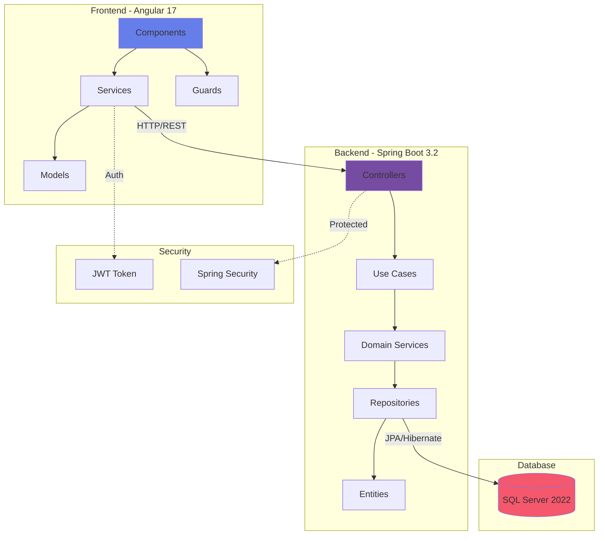

### Architecture DDD (Domain-Driven Design)

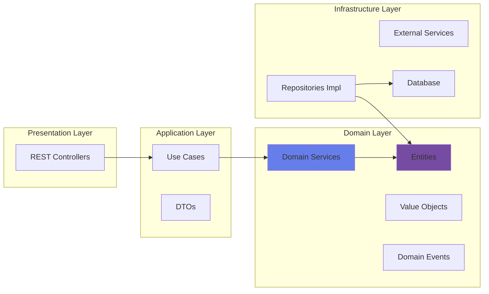

---

## 📊 Diagrammes

### Diagramme de Classes - Domaine Principal

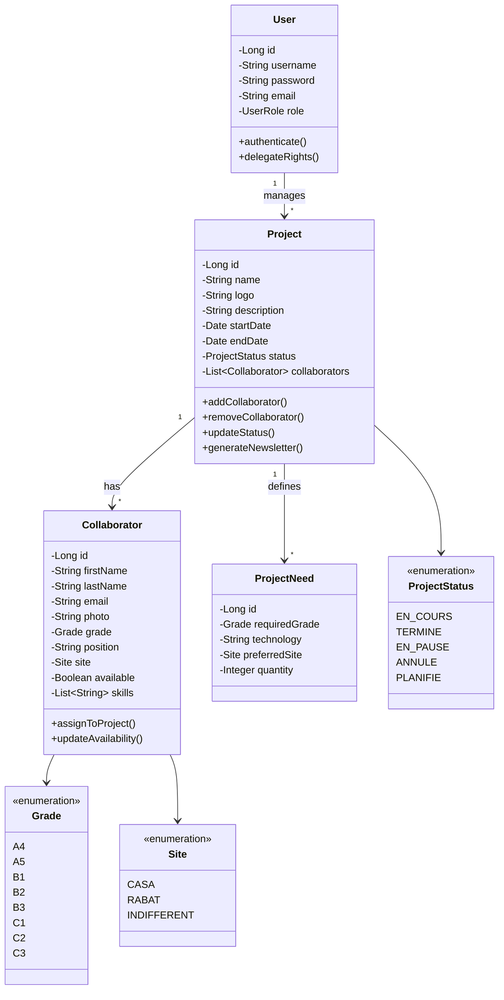

### Diagramme de Séquence - Authentification

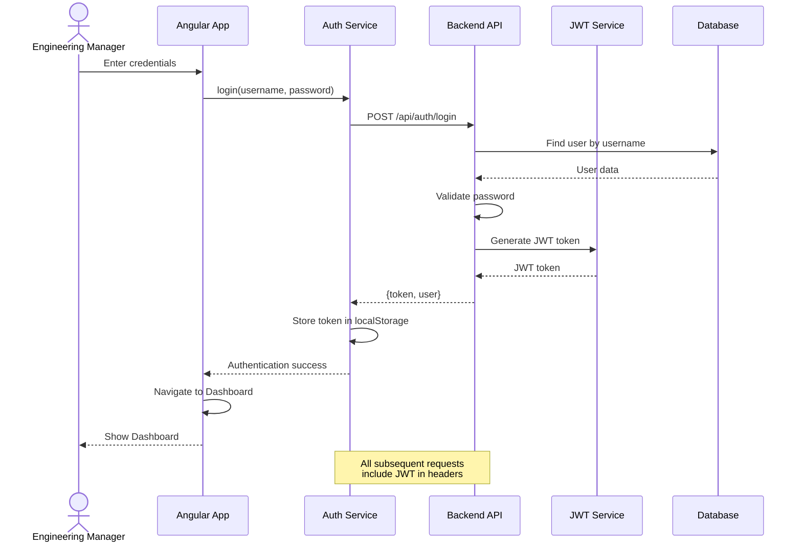

### Diagramme de Séquence - Gestion de Projet

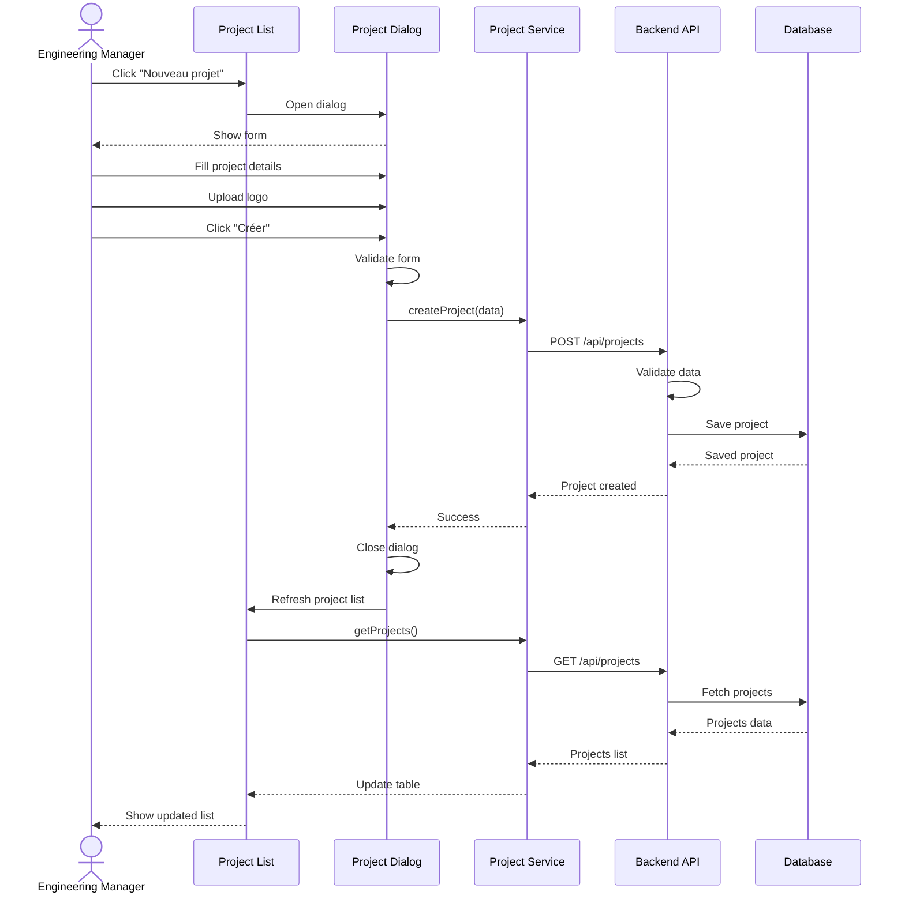

### Diagramme de Séquence - Affectation Collaborateur à Projet

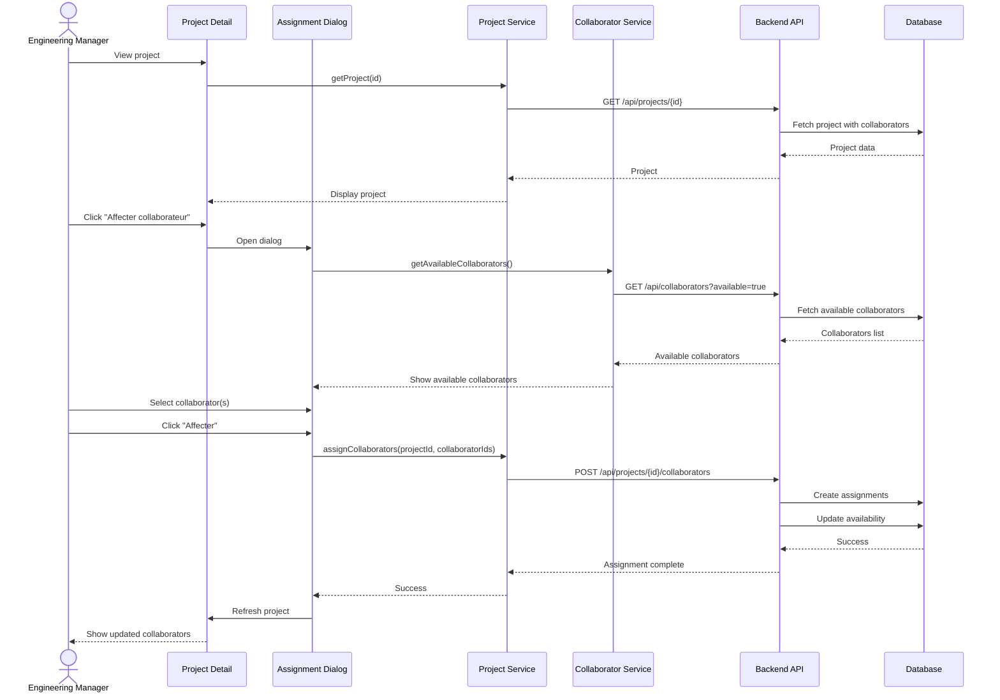

### Diagramme de Séquence - Génération Newsletter PDF

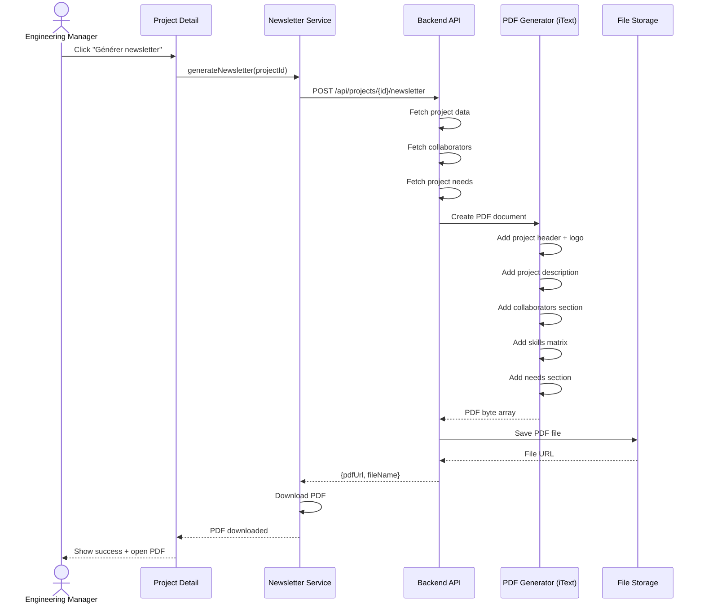

### Diagramme de Flux - Cycle de Vie d'un Projet

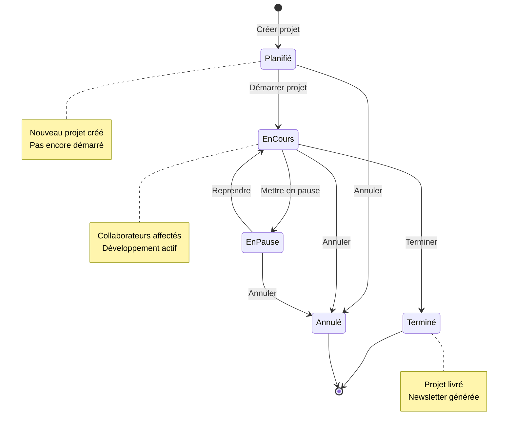

### Architecture Frontend - Structure des Composants

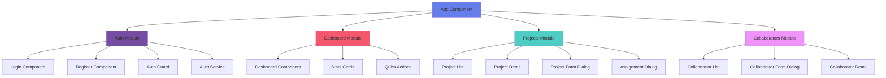

### Flux de Données - Architecture Réactive

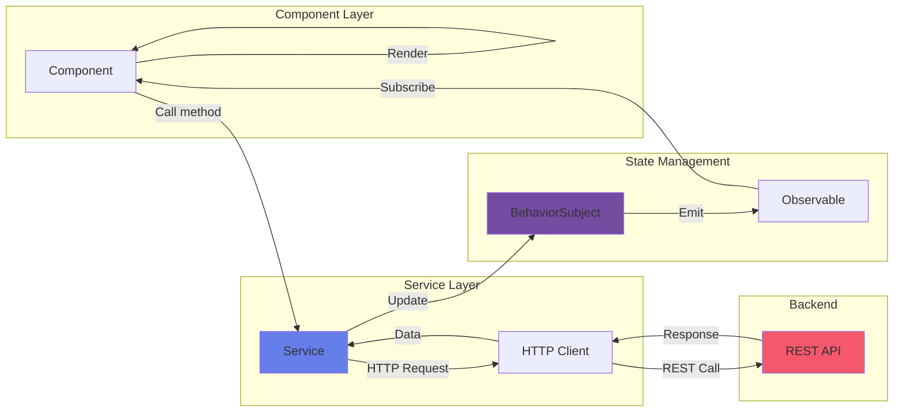

---

## 📁 Structure du Projet

### Backend (Spring Boot)

```
back/
├── src/main/java/com/digicampmonitoring/
│   ├── application/
│   │   ├── usecases/
│   │   │   ├── project/
│   │   │   │   ├── CreateProjectUseCase.java
│   │   │   │   ├── UpdateProjectUseCase.java
│   │   │   │   ├── DeleteProjectUseCase.java
│   │   │   │   ├── GetProjectsUseCase.java
│   │   │   │   └── GenerateNewsletterUseCase.java
│   │   │   ├── collaborator/
│   │   │   │   ├── CreateCollaboratorUseCase.java
│   │   │   │   ├── UpdateCollaboratorUseCase.java
│   │   │   │   ├── DeleteCollaboratorUseCase.java
│   │   │   │   └── GetCollaboratorsUseCase.java
│   │   │   └── auth/
│   │   │       ├── LoginUseCase.java
│   │   │       └── RegisterUseCase.java
│   │   └── dto/
│   ├── domain/
│   │   ├── model/
│   │   │   ├── Project.java
│   │   │   ├── Collaborator.java
│   │   │   ├── User.java
│   │   │   └── ProjectNeed.java
│   │   ├── repository/
│   │   │   ├── ProjectRepository.java
│   │   │   ├── CollaboratorRepository.java
│   │   │   └── UserRepository.java
│   │   └── service/
│   │       ├── ProjectDomainService.java
│   │       ├── CollaboratorDomainService.java
│   │       └── NewsletterService.java
│   ├── infrastructure/
│   │   ├── config/
│   │   │   ├── SecurityConfiguration.java
│   │   │   ├── JwtConfiguration.java
│   │   │   └── CorsConfiguration.java
│   │   ├── security/
│   │   │   ├── JwtTokenProvider.java
│   │   │   ├── JwtAuthenticationFilter.java
│   │   │   └── CustomUserDetailsService.java
│   │   └── persistence/
│   │       └── JpaRepositories
│   └── presentation/
│       └── controller/
│           ├── AuthController.java
│           ├── ProjectController.java
│           └── CollaboratorController.java
└── resources/
    ├── application.properties
    └── db/migration/
```

### Frontend (Angular 17)

```
front/
├── src/app/
│   ├── core/
│   │   ├── guards/
│   │   │   └── auth.guard.ts
│   │   ├── interceptors/
│   │   │   └── jwt.interceptor.ts
│   │   ├── models/
│   │   │   ├── project.model.ts
│   │   │   ├── collaborator.model.ts
│   │   │   └── user.model.ts
│   │   └── services/
│   │       ├── auth.service.ts
│   │       ├── project.service.ts
│   │       └── collaborator.service.ts
│   ├── features/
│   │   ├── authentication/
│   │   │   ├── login/
│   │   │   │   └── login.component.ts
│   │   │   └── register/
│   │   │       └── register.component.ts
│   │   ├── dashboard/
│   │   │   └── dashboard.component.ts
│   │   ├── projects/
│   │   │   ├── project-list/
│   │   │   │   └── project-list.component.ts
│   │   │   ├── project-detail/
│   │   │   │   └── project-detail.component.ts
│   │   │   └── components/
│   │   │       ├── project-form-dialog/
│   │   │       └── assignment-dialog/
│   │   └── collaborators/
│   │       ├── collaborator-list/
│   │       │   └── collaborator-list.component.ts
│   │       └── components/
│   │           └── collaborator-form-dialog/
│   ├── shared/
│   │   └── components/
│   └── app.routes.ts
```

---

## 🛠️ Technologies

### Backend
- **Java 17** - Langage de programmation
- **Spring Boot 3.2.0** - Framework backend
- **Spring Security** - Sécurité et authentification
- **JWT (JJWT 0.12.3)** - Tokens d'authentification
- **JPA/Hibernate** - ORM
- **SQL Server 2022** - Base de données
- **iText 7** - Génération PDF
- **Lombok** - Réduction du code boilerplate
- **Maven** - Gestion des dépendances

### Frontend
- **Angular 17** - Framework frontend
- **TypeScript 5.2** - Langage
- **PrimeNG** - Bibliothèque UI
  - Table, Dialog, Calendar, Editor
  - FileUpload, Dropdown, Chips
  - Button, Card, Avatar, Tag
- **RxJS** - Programmation réactive
- **SCSS** - Styles

### DevOps
- **Docker & Docker Compose** - Conteneurisation
- **Git & GitHub** - Contrôle de version

---

## 🚀 Installation

### Prérequis
- Docker Desktop
- Git
- Node.js 18+ (pour développement frontend local)
- Java 17+ (pour développement backend local)

### Installation avec Docker

```bash
# 1. Cloner le projet
git clone https://github.com/Soufiane4906/DigicampMonitoring.git
cd DigicampMonitoring

# 2. Démarrer tous les services
docker-compose up -d

# 3. Vérifier les logs
docker-compose logs -f

# 4. Accéder à l'application
# Frontend: http://localhost
# Backend API: http://localhost:8080
# SQL Server: localhost:1433
```

### Installation locale (Développement)

#### Backend
```bash
cd back
./mvnw clean install
./mvnw spring-boot:run
```

#### Frontend
```bash
cd front
npm install
npm start
# Application disponible sur http://localhost:4200
```

---

## 📖 Utilisation

### 1. Première connexion

1. Accédez à `http://localhost`
2. Créez un compte (Register)
3. Connectez-vous avec vos identifiants

### 2. Gestion des Projets

#### Créer un projet
1. Dashboard → Cliquez sur "Projets" ou carte "Gérer les projets"
2. Cliquez sur "Nouveau projet"
3. Remplissez le formulaire :
   - Nom du projet (requis)
   - Logo (optionnel, max 1MB)
   - Description/Objectifs (éditeur riche)
   - Date de début (requise)
   - Date de fin (optionnelle)
   - Statut (requis)
4. Cliquez sur "Créer"

#### Modifier un projet
1. Liste des projets → Cliquez sur l'icône "crayon"
2. Modifiez les champs souhaités
3. Cliquez sur "Mettre à jour"

#### Supprimer un projet
1. Liste des projets → Cliquez sur l'icône "corbeille"
2. Confirmez la suppression

### 3. Gestion des Collaborateurs

#### Ajouter un collaborateur
1. Dashboard → Cliquez sur "Collaborateurs"
2. Cliquez sur "Nouveau collaborateur"
3. Remplissez le formulaire :
   - Photo (optionnelle)
   - Prénom & Nom (requis)
   - Email professionnel (requis)
   - Grade (A4-C3, requis)
   - Poste/Rôle (requis)
   - Site (Casa/Rabat/Indifférent, requis)
   - Disponibilité (toggle)
   - Compétences (liste de skills)
4. Cliquez sur "Créer"

### 4. Affectation Collaborateurs → Projets

1. Accédez à un projet
2. Cliquez sur "Affecter collaborateur"
3. Sélectionnez les collaborateurs disponibles
4. Cliquez sur "Affecter"

### 5. Génération Newsletter PDF

1. Accédez à un projet
2. Cliquez sur "Générer newsletter"
3. Le PDF est généré et téléchargé automatiquement

---

## 🔐 Sécurité

### Authentification JWT

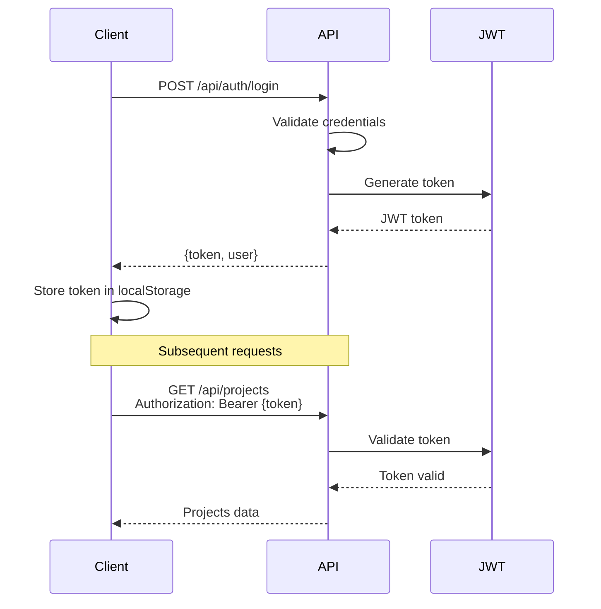

### Endpoints Protégés

| Endpoint | Méthode | Auth Required | Description |
|----------|---------|---------------|-------------|
| `/api/auth/login` | POST | ❌ | Authentification |
| `/api/auth/register` | POST | ❌ | Inscription |
| `/api/projects/**` | ALL | ✅ | Gestion projets |
| `/api/collaborators/**` | ALL | ✅ | Gestion collaborateurs |
| `/api/users/**` | ALL | ✅ | Gestion utilisateurs |

---

## 📝 API Documentation

### Projets

```http
GET    /api/projects?page=0&size=10
POST   /api/projects
GET    /api/projects/{id}
PUT    /api/projects/{id}
DELETE /api/projects/{id}
POST   /api/projects/{id}/collaborators
POST   /api/projects/{id}/newsletter
```

### Collaborateurs

```http
GET    /api/collaborators?page=0&size=10&available=true
POST   /api/collaborators
GET    /api/collaborators/{id}
PUT    /api/collaborators/{id}
DELETE /api/collaborators/{id}
```

### Authentification

```http
POST   /api/auth/login
POST   /api/auth/register
GET    /api/auth/me
```

---

## 🧪 Tests

### Tests Unitaires Backend
```bash
cd back
./mvnw test
```

### Tests E2E Frontend
```bash
cd front
npm run e2e
```

---

## 📊 Modèle de Données

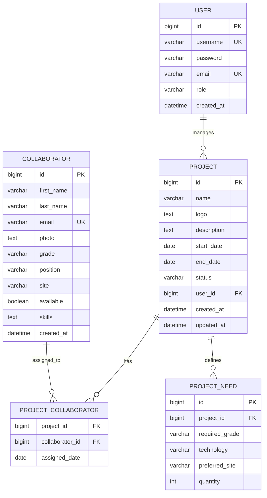

---

## 🎨 Design System

### Couleurs Principales

| Couleur | Hex | Usage |
|---------|-----|-------|
| Primary Purple | `#667eea` | Buttons, Links, Headers |
| Secondary Purple | `#764ba2` | Gradients, Accents |
| Success | `#4CAF50` | Success states |
| Warning | `#FF9800` | Warning states |
| Danger | `#f5576c` | Errors, Delete actions |
| Info | `#2196F3` | Information |

### Gradients

```scss
// Main gradient
background: linear-gradient(135deg, #667eea 0%, #764ba2 100%);

// Collaborator gradient
background: linear-gradient(135deg, #f093fb 0%, #f5576c 100%);

// Background gradient
background: linear-gradient(135deg, #f5f7fa 0%, #c3cfe2 100%);
```

---

## 🤝 Contribution

1. Fork le projet
2. Créer une branche (`git checkout -b feature/AmazingFeature`)
3. Commit les changements (`git commit -m 'Add AmazingFeature'`)
4. Push vers la branche (`git push origin feature/AmazingFeature`)
5. Ouvrir une Pull Request

---

## 📄 Licence

Ce projet est privé et destiné uniquement à un usage interne.

---

## 👥 Contact

- **Engineering Manager**: Digicamp
- **Repository**: https://github.com/Soufiane4906/DigicampMonitoring

---

**Dernière mise à jour**: 12 octobre 2025
