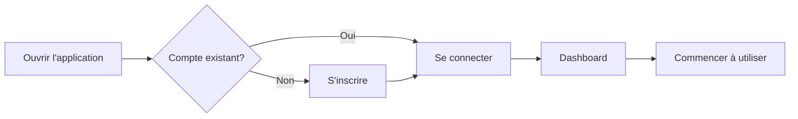
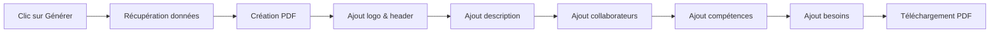

# 📖 Guide Utilisateur - DigicampMonitoring

## 🎯 Bienvenue !

Bienvenue dans **DigicampMonitoring**, votre outil de gestion des projets et des ressources Digicamp. Ce guide vous aidera à maîtriser toutes les fonctionnalités de l'application.

---

## 📋 Table des Matières

1. [Démarrage Rapide](#-démarrage-rapide)
2. [Authentification](#-authentification)
3. [Dashboard](#-dashboard)
4. [Gestion des Projets](#-gestion-des-projets)
5. [Gestion des Collaborateurs](#-gestion-des-collaborateurs)
6. [Affectation des Ressources](#-affectation-des-ressources)
7. [Génération de Newsletter](#-génération-de-newsletter)
8. [Conseils et Astuces](#-conseils-et-astuces)
9. [FAQ](#-faq)

---

## 🚀 Démarrage Rapide

### Accès à l'Application

1. **URL**: Ouvrez votre navigateur et accédez à `http://localhost`
2. **Compatible avec**:
   - Chrome (recommandé)
   - Firefox
   - Edge
   - Safari

### Premier Lancement



---

## 🔐 Authentification

### Création de Compte (Inscription)

1. Sur la page d'accueil, cliquez sur **"S'inscrire"** ou **"Créer un compte"**
2. Remplissez le formulaire :
   
   | Champ | Description | Requis | Format |
   |-------|-------------|---------|--------|
   | Nom d'utilisateur | Identifiant unique | ✅ | Minimum 3 caractères |
   | Email | Adresse email professionnelle | ✅ | format@example.com |
   | Mot de passe | Mot de passe sécurisé | ✅ | Minimum 8 caractères |
   | Confirmation | Répétez le mot de passe | ✅ | Doit correspondre |

3. **Validation du mot de passe** :
   - ✅ Au moins 8 caractères
   - ✅ Au moins une lettre majuscule
   - ✅ Au moins une lettre minuscule
   - ✅ Au moins un chiffre
   - ✅ Au moins un caractère spécial

4. Cliquez sur **"S'inscrire"**
5. Vous êtes automatiquement connecté

### Connexion

1. Sur la page d'accueil, entrez :
   - **Nom d'utilisateur**
   - **Mot de passe**
2. Cliquez sur **"Se connecter"**
3. Vous êtes redirigé vers le Dashboard

### Déconnexion

- Cliquez sur l'icône **déconnexion** (🔓) en haut à droite
- Vous êtes redirigé vers la page de connexion

---

## 📊 Dashboard

Le **Dashboard** est votre page d'accueil après connexion. Il vous donne une vue d'ensemble de votre activité.

### Structure du Dashboard

```
┌─────────────────────────────────────────────────────────┐
│  🎯 DigicampMonitoring      Dashboard  Projets  Collabs │ [Avatar] Déconnexion
├─────────────────────────────────────────────────────────┤
│                                                          │
│  👋 Bienvenue, [Nom d'utilisateur] !                   │
│  Tableau de bord - Gérez vos projets et ressources     │
│                                                          │
│  ┌──────────────┐  ┌──────────────┐                    │
│  │ 📁 Projets   │  │ 👥 Collabor. │                    │
│  │    [X]       │  │     [Y]      │                    │
│  └──────────────┘  └──────────────┘                    │
│                                                          │
│  Actions Rapides:                                       │
│  ┌──────────┐ ┌──────────┐ ┌──────────┐ ┌──────────┐  │
│  │ Gérer    │ │ Gérer    │ │Newsletter│ │Rapports  │  │
│  │ Projets  │ │ Collabs  │ │          │ │          │  │
│  └──────────┘ └──────────┘ └──────────┘ └──────────┘  │
└─────────────────────────────────────────────────────────┘
```

### Cartes de Statistiques

1. **📁 Projets**
   - Affiche le nombre total de projets
   - Couleur : Bleu gradient

2. **👥 Collaborateurs**
   - Affiche le nombre total de collaborateurs
   - Couleur : Rose gradient

### Actions Rapides

- **Gérer les projets** : Accès direct à la liste des projets
- **Gérer les collaborateurs** : Accès direct à la liste des collaborateurs
- **Newsletter** : Génération de newsletters (bientôt disponible)
- **Rapports** : Statistiques et rapports (bientôt disponible)

---

## 📁 Gestion des Projets

### Vue d'ensemble

La page **Projets** vous permet de gérer tous vos projets Digicamp en un seul endroit.

### Lister les Projets

1. Depuis le Dashboard, cliquez sur **"Projets"** dans le menu ou la carte "Gérer les projets"
2. Vous voyez la liste complète avec :
   - **Nom** du projet avec logo/initiales
   - **Description**
   - **Date de début**
   - **Date de fin**
   - **Statut** (badge coloré)
   - **Actions** (voir, modifier, supprimer)

### Barre d'Outils

```
┌─────────────────────────────────────────────────────┐
│ 🔍 Rechercher un projet...  [Filtres] [↻ Actualiser]│
└─────────────────────────────────────────────────────┘
```

- **Recherche** : Tapez pour filtrer en temps réel
- **Filtres** : Filtrer par statut, date, etc.
- **Actualiser** : Recharger la liste

### Créer un Nouveau Projet

#### 1. Cliquer sur "Nouveau projet"

Bouton vert en haut à droite de la page

#### 2. Remplir le Formulaire

| Champ | Type | Requis | Description |
|-------|------|--------|-------------|
| **Nom du projet** | Texte | ✅ | Nom unique du projet |
| **Logo** | Image | ❌ | JPG/PNG, max 1MB |
| **Description/Objectifs** | Éditeur riche | ✅ | Objectifs détaillés, formatage possible |
| **Date de début** | Date | ✅ | Date de lancement prévue |
| **Date de fin** | Date | ❌ | Date de fin prévue |
| **Statut** | Liste | ✅ | En cours, Terminé, En pause, Annulé, Planifié |

#### 3. Éditeur de Description

L'éditeur riche vous permet de :
- ✍️ Formater le texte (gras, italique, souligné)
- 📝 Créer des listes à puces ou numérotées
- 🔗 Ajouter des liens
- 🎨 Changer la couleur du texte
- 📏 Aligner le texte

#### 4. Upload du Logo

1. Cliquez sur **"Choisir une image"**
2. Sélectionnez un fichier (JPG, PNG, GIF)
3. **Limite** : 1 MB
4. **Aperçu** : L'image s'affiche immédiatement
5. Pour **supprimer** : Cliquez sur le ❌ sur l'aperçu

#### 5. Sélection du Statut

| Statut | Couleur | Signification |
|--------|---------|---------------|
| 🟣 Planifié | Violet | Projet pas encore démarré |
| 🔵 En cours | Bleu | Projet en développement actif |
| 🟢 Terminé | Vert | Projet livré et terminé |
| 🟠 En pause | Orange | Projet temporairement suspendu |
| 🔴 Annulé | Rouge | Projet abandonné |

#### 6. Validation et Création

1. Tous les champs requis (⭐) doivent être remplis
2. Les erreurs sont affichées en rouge
3. Cliquez sur **"Créer"**
4. Un message de succès s'affiche
5. Le projet apparaît dans la liste

### Modifier un Projet

1. Dans la liste des projets, cliquez sur l'icône **✏️ (crayon)**
2. Le formulaire s'ouvre avec les données existantes
3. Modifiez les champs souhaités
4. Cliquez sur **"Mettre à jour"**
5. Les modifications sont enregistrées

### Supprimer un Projet

⚠️ **Attention** : Cette action est **irréversible** !

1. Dans la liste, cliquez sur l'icône **🗑️ (corbeille)**
2. Une fenêtre de confirmation apparaît
3. Confirmez pour supprimer définitivement

### Voir les Détails d'un Projet

1. Cliquez sur l'icône **👁️ (œil)**
2. Une page détaillée s'affiche avec :
   - Informations complètes
   - Liste des collaborateurs affectés
   - Besoins en ressources
   - Option de génération de newsletter

---

## 👥 Gestion des Collaborateurs

### Lister les Collaborateurs

1. Depuis le Dashboard, cliquez sur **"Collaborateurs"**
2. Vous voyez tous les collaborateurs avec :
   - **Photo/Initiales**
   - **Nom complet**
   - **Email**
   - **Grade**
   - **Poste**
   - **Site**
   - **Compétences** (3 premières + compteur)
   - **Disponibilité** (Disponible/Occupé)
   - **Actions**

### Structure du Tableau

```
┌────────────────────────────────────────────────────────────┐
│ [👤]  Jean Dupont        │ jean@company.com  │ B2  │ ...   │
│       Développeur         │                    │     │       │
├────────────────────────────────────────────────────────────┤
│ Compétences: [Java] [Angular] [Docker] +5                 │
│ Disponibilité: [✅ Disponible]                            │
│ Actions: [👁️] [✏️] [🗑️]                                  │
└────────────────────────────────────────────────────────────┘
```

### Créer un Collaborateur

#### 1. Cliquer sur "Nouveau collaborateur"

Bouton vert en haut à droite

#### 2. Remplir le Formulaire

##### Section Photo

- Cliquez sur **"Choisir une photo"**
- **Formats acceptés** : JPG, PNG, GIF
- **Taille max** : 1 MB
- **Recommandation** : Photo professionnelle, fond neutre
- L'aperçu s'affiche en cercle

##### Informations Personnelles

| Champ | Requis | Format |
|-------|---------|--------|
| **Prénom** | ✅ | Texte |
| **Nom** | ✅ | Texte |
| **Email** | ✅ | format@company.com |

##### Informations Professionnelles

**Grade** (liste déroulante) :
- A4, A5 - Juniors
- B1, B2, B3 - Intermédiaires
- C1, C2, C3 - Seniors

**Poste/Rôle** (liste éditable) :
- Développeur
- Tech Lead
- Architecte
- Product Owner
- Scrum Master
- QA Engineer
- DevOps Engineer
- Business Analyst
- UI/UX Designer
- _Ou saisissez un poste personnalisé_

**Site d'affectation** :
- 🏢 Casa
- 🏢 Rabat
- 🌍 Indifférent

##### Disponibilité

Toggle switch :
- ✅ **Disponible** (vert) - Peut être affecté à un nouveau projet
- ❌ **Occupé** (gris) - Déjà affecté à un/des projet(s)

##### Compétences Techniques

- Champ de saisie avec **tags**
- Appuyez sur **Entrée** ou **Tab** pour ajouter une compétence
- **Exemples** : Java, Angular, Docker, Kubernetes, Spring Boot
- **Maximum** : 10 compétences
- Pour **supprimer** : Cliquez sur le ❌ du tag

#### 3. Validation et Création

1. Vérifiez tous les champs requis
2. Cliquez sur **"Créer"**
3. Le collaborateur est ajouté à la liste

### Modifier un Collaborateur

1. Cliquez sur l'icône **✏️**
2. Modifiez les informations
3. **"Mettre à jour"**

### Supprimer un Collaborateur

⚠️ **Attention** : Si le collaborateur est affecté à des projets, il sera désaffecté !

1. Cliquez sur **🗑️**
2. Confirmez la suppression

---

## 🔗 Affectation des Ressources

### Affecter un Collaborateur à un Projet

#### Méthode 1 : Depuis le Projet

1. Ouvrez les **détails du projet**
2. Section "Collaborateurs"
3. Cliquez sur **"+ Affecter un collaborateur"**
4. **Sélectionnez** un ou plusieurs collaborateurs disponibles
5. Cliquez sur **"Affecter"**

#### Méthode 2 : Depuis le Collaborateur

1. Ouvrez les **détails du collaborateur**
2. Section "Projets"
3. Cliquez sur **"+ Affecter à un projet"**
4. Sélectionnez un ou plusieurs projets
5. Cliquez sur **"Affecter"**

### Filtrage des Collaborateurs Disponibles

La liste affiche automatiquement :
- ✅ **Disponibles** : Collaborateurs marqués comme disponibles
- ⚠️ **Partiellement disponibles** : Affectés mais avec capacité restante
- ❌ **Occupés** : Pas affichés par défaut (activez le filtre "Tous")

### Désaffecter un Collaborateur

1. Dans les détails du projet
2. Liste des collaborateurs affectés
3. Cliquez sur **❌** à côté du collaborateur
4. Confirmez la désaffectation
5. Le collaborateur repasse **Disponible**

---

## 📄 Génération de Newsletter

### Vue d'ensemble

La newsletter PDF présente un projet de manière professionnelle, incluant :
- 📊 Informations du projet (nom, logo, statut)
- 📝 Description et objectifs
- 👥 Collaborateurs affectés avec photos
- 🎯 Besoins en ressources

### Générer une Newsletter

#### 1. Accéder au Projet

- Ouvrez les **détails du projet**
- Ou utilisez le bouton **Newsletter** sur la carte du projet

#### 2. Cliquer sur "Générer Newsletter"

Bouton **📄 Générer la newsletter**

#### 3. Processus de Génération



#### 4. Contenu de la Newsletter

##### Page 1 : Header
- **Logo** du projet (si disponible)
- **Nom** du projet en grand
- **Statut** avec badge coloré
- **Dates** de début et fin

##### Page 2 : Description
- **Objectifs** du projet
- **Description détaillée**
- **Technologies** utilisées

##### Page 3 : Équipe
- **Photos** des collaborateurs
- **Noms et rôles**
- **Grades**
- **Matrix des compétences**

##### Page 4 : Besoins
- **Profils recherchés**
- **Compétences requises**
- **Sites préférés**
- **Quantité nécessaire**

#### 5. Téléchargement

- Le PDF est **généré automatiquement**
- **Téléchargement** direct dans votre navigateur
- **Nom du fichier** : `Newsletter_[NomProjet]_[Date].pdf`
- **Format** : PDF optimisé pour l'impression

### Template de la Newsletter

Inspiré de : https://sway.office.com/0DlBZo6xCfurARIl

---

## 💡 Conseils et Astuces

### 🎨 Personnalisation

1. **Logos de Qualité**
   - Utilisez des logos **vectoriels** (SVG) ou haute résolution
   - Fond **transparent** recommandé
   - Dimensions **carrées** pour un meilleur rendu

2. **Photos Professionnelles**
   - Format **portrait**
   - Fond **neutre**
   - Éclairage **uniforme**
   - Taille **optimale** : 400x400px

### 🔍 Recherche Efficace

- **Recherche de Projets** : Tapez le nom, la description, ou le statut
- **Recherche de Collaborateurs** : Nom, email, poste, ou compétence
- **Filtres** : Combinez recherche + filtres pour affiner

### ⌨️ Raccourcis Clavier

| Raccourci | Action |
|-----------|--------|
| `Ctrl + S` | Sauvegarder le formulaire |
| `Esc` | Fermer un dialog |
| `Ctrl + F` | Focus sur la recherche |
| `Tab` | Navigation entre champs |

### 🚀 Performance

- **Pagination** : 10 éléments par page par défaut
- **Lazy Loading** : Les données sont chargées à la demande
- **Cache** : Les données fréquemment utilisées sont mises en cache

### 📱 Responsive Design

L'application s'adapte à tous les écrans :
- 💻 **Desktop** : Vue complète avec toutes les colonnes
- 📱 **Tablette** : Vue optimisée, colonnes empilées
- 📱 **Mobile** : Vue simplifiée, navigation par accordéon

---

## ❓ FAQ

### Questions Générales

**Q : Puis-je utiliser l'application hors ligne ?**
> R : Non, une connexion Internet est requise pour accéder aux données en temps réel.

**Q : Combien d'utilisateurs peuvent se connecter simultanément ?**
> R : Actuellement, l'application est conçue pour un **seul utilisateur** (l'EM). La fonctionnalité de délégation est prévue.

**Q : Mes données sont-elles sauvegardées automatiquement ?**
> R : Oui, toutes les modifications sont **sauvegardées immédiatement** dans la base de données.

### Projets

**Q : Quelle est la différence entre "En pause" et "Annulé" ?**
> R : 
> - **En pause** : Le projet est temporairement suspendu mais reprendra
> - **Annulé** : Le projet est définitivement abandonné

**Q : Puis-je avoir plusieurs projets avec le même nom ?**
> R : Oui, mais ce n'est **pas recommandé** pour éviter les confusions.

**Q : Combien de collaborateurs puis-je affecter à un projet ?**
> R : **Illimité**. Vous pouvez affecter autant de collaborateurs que nécessaire.

### Collaborateurs

**Q : Comment gérer les collaborateurs partagés entre plusieurs projets ?**
> R : Affectez-les à plusieurs projets. Leur disponibilité sera automatiquement mise à jour.

**Q : Puis-je importer des collaborateurs en masse ?**
> R : Cette fonctionnalité est **en développement**. Pour l'instant, ajoutez-les un par un.

**Q : Que se passe-t-il si je supprime un collaborateur affecté à des projets ?**
> R : Le collaborateur sera **désaffecté automatiquement** de tous les projets avant suppression.

### Newsletter

**Q : Puis-je personnaliser le template de la newsletter ?**
> R : Pour l'instant, le template est **fixe**. La personnalisation est prévue dans une version future.

**Q : Les newsletters sont-elles sauvegardées ?**
> R : Oui, chaque newsletter générée est **archivée** et accessible depuis l'historique du projet.

**Q : Puis-je générer plusieurs newsletters pour le même projet ?**
> R : Oui, vous pouvez générer une newsletter à chaque mise à jour importante du projet.

### Sécurité

**Q : Mon mot de passe est-il stocké en clair ?**
> R : **Non**, votre mot de passe est **hashé** (bcrypt) avant d'être stocké. Nous ne pouvons pas le voir.

**Q : Combien de temps ma session reste-t-elle active ?**
> R : **24 heures**. Après ce délai, vous devrez vous reconnecter.

**Q : Puis-je me connecter depuis plusieurs navigateurs ?**
> R : Oui, votre **token JWT** est valide sur tous les navigateurs.

### Problèmes Courants

**Q : J'ai oublié mon mot de passe, que faire ?**
> R : Contactez l'administrateur pour une réinitialisation manuelle. La fonctionnalité "Mot de passe oublié" est **en développement**.

**Q : Les images ne s'affichent pas, pourquoi ?**
> R : Vérifiez :
> - La **taille** du fichier (max 1MB)
> - Le **format** (JPG, PNG, GIF uniquement)
> - Votre **connexion Internet**

**Q : La recherche ne fonctionne pas**
> R : Assurez-vous d'avoir tapé au moins **3 caractères**. La recherche est sensible à la casse.

**Q : Le PDF ne se télécharge pas**
> R : Vérifiez les **paramètres de votre navigateur**. Autorisez les téléchargements depuis `localhost`.

---

## 🆘 Support

### Besoin d'Aide ?

1. **Documentation** : Consultez ce guide
2. **FAQ** : Vérifiez la section ci-dessus
3. **Contact** : engineering.manager@digicamp.com

### Signaler un Bug

Si vous rencontrez un problème :

1. **Décrivez** le problème en détail
2. **Capturez** une capture d'écran si possible
3. **Notez** les étapes pour reproduire le bug
4. **Envoyez** un email au support

### Proposer une Amélioration

Vos suggestions sont les bienvenues !

- **Email** : suggestions@digicamp.com
- **Format** : [Titre] Description détaillée de la fonctionnalité

---

## 📚 Ressources Complémentaires

- 📘 [Documentation Technique](./TECHNICAL_DOCUMENTATION.md)
- 🎨 [Guide de Style](./STYLE_GUIDE.md)
- 🏗️ [Architecture](./ARCHITECTURE.md)
- 🔧 [Guide Développeur](./DEVELOPER_GUIDE.md)

---

**Bonne utilisation de DigicampMonitoring ! 🚀**

_Dernière mise à jour : 12 octobre 2025_
